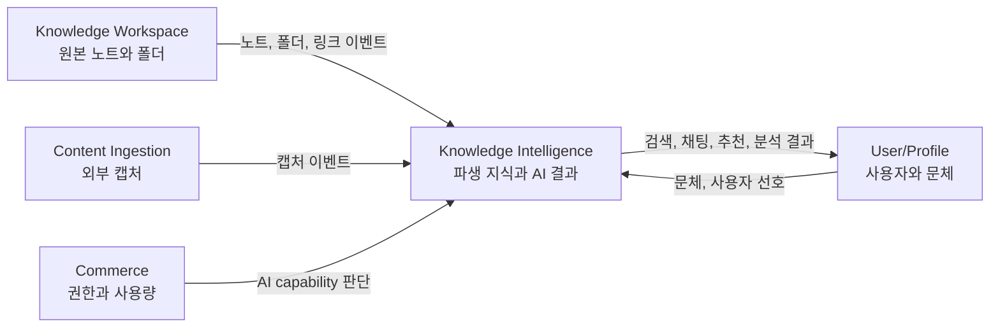

# Knowledge Intelligence 데이터 소유권과 파생 지식 모델

이 문서는 Intelligence-Service가 어떤 데이터를 직접 소유하고, 어떤 데이터는 다른 도메인에서 온 사실을 바탕으로 파생해서 보관하는지 설명한다. 운영 DDL이나 JPA 구조가 아니라, 사람이 도메인 책임을 이해하기 위한 문서다.

## 한 문장 요약

Intelligence-Service는 원본 노트 저장소가 아니라, 사용자가 자신의 지식을 더 잘 찾고, 쓰고, 연결하고, 정리하고, 분석할 수 있도록 **AI 사용 설정과 파생 지식 상태**를 관리하는 서비스다.

## 원본과 파생 데이터

BrainX에서 원본 지식은 `Knowledge Workspace`가 소유한다. 노트 본문, 폴더, 링크, 삭제 상태 같은 사실은 Workspace가 기준이다. Intelligence-Service는 그 사실을 이벤트나 내부 API로 받아 검색, RAG, 추천, 분석에 필요한 형태로 다시 정리한다.

중요한 경계는 다음과 같다.

- 원본 노트와 폴더의 최종 진실은 Workspace에 있다.
- AI 기능 사용 가능 여부와 quota 판단은 Commerce/entitlement 쪽이 기준이다.
- 외부 AI provider의 실제 모델 상태와 장애는 provider adapter가 판단한다.
- Intelligence-Service DB는 위 사실을 복제한 권한 원천이 아니라, 지식 활용을 빠르게 만들기 위한 파생 상태와 사용자 AI 결과를 담는다.

## Intelligence-Service가 소유하는 것

### AI 사용 환경

사용자는 어떤 모델을 기본으로 쓸지, 어떤 문체로 도움을 받을지 정한다. 이 설정은 작성 보조, 채팅, 추천, 분석 결과의 말투와 모델 선택에 영향을 준다.

- 기본 모델과 사용자 provider 설정
- 문체 프로필
- 모델 catalog와 token 비용 기준

### 지식 read model

Workspace에서 온 노트와 폴더 사실은 Intelligence에서 검색과 추천에 맞는 읽기 모델로 바뀐다. 이 모델은 eventually consistent 하며, 원본을 대체하지 않는다.

- 노트 제목, 태그, 폴더, 상태, 본문 hash, 검색 색인 상태
- chunk manifest와 vector index metadata
- 캡처, 폴더, 링크 projection
- 노트 요약 cache

### AI 상호작용 기록

사용자가 AI와 주고받은 결과나 제안 결과는 사용자 경험을 이어가기 위해 저장한다.

- RAG 채팅 thread와 message
- 작성 보조, 링크 추천, 브릿지 후보, 폴더 정리 제안 이벤트
- token usage와 비용 추정 요청

### 분석 산출물

클러스터링과 인사이트 리포트는 특정 시점의 노트 상태를 바탕으로 만든 분석 결과다. 원본 노트가 바뀌면 새 분석이 필요할 수 있다.

- 지식 구조 분석 job과 cluster 결과
- 인사이트 리포트 job과 지식 공백, 추천사항, 학습 제안

## 데이터가 흘러가는 방식

### 1. 노트가 바뀐다

Workspace에서 노트 생성, 본문 저장, metadata 변경, 태그 변경, 휴지통 이동, 삭제 이벤트가 발생한다. Intelligence는 note projection을 갱신하고, 본문이 바뀌면 summary와 vector index를 최신화 대상으로 본다.

### 2. 사용자가 AI 기능을 요청한다

사용자가 검색, 작성 보조, 채팅, 링크 추천, 폴더 정리, 클러스터링, 인사이트 기능을 요청하면 Intelligence는 먼저 사용자의 권한과 모델 설정을 확인한다. 그 다음 note projection, chunk manifest, vector search 결과, 사용자 문체를 조합해 AI provider에 요청한다.

### 3. 결과가 남는다

응답이 생성되면 Intelligence는 사용자에게 결과를 돌려주고, 필요한 경우 결과 이벤트와 token usage 기록 요청을 발행한다. 채팅처럼 이어지는 경험은 thread/message로 저장하고, 폴더 정리 제안처럼 즉시 검토하는 결과는 sync response 중심으로 반환한다.

### 4. 원본이 삭제되거나 사용자가 탈퇴한다

노트 삭제 이벤트가 오면 해당 노트의 summary, vector index, chunk manifest 같은 파생 상태를 제거하거나 제외한다. 사용자 삭제 요청은 사용자의 AI 설정, 문체, projection, cache, job result, 채팅 기록 등 사용자 소유 파생 데이터의 정리 기준이 된다.

## 운영 DB를 보는 관점

운영 DB table은 위 도메인 책임을 저장 형태로 나눈 것이다. table 자체가 도메인의 언어는 아니지만, 어떤 책임이 어느 저장 구조에 대응하는지 알면 장애 조사와 migration 검토가 쉬워진다.

| 도메인 책임 | 대표 저장 대상 |
| --- | --- |
| AI 사용 환경 | `ai_models`, `user_ai_model_settings`, `user_style_profiles` |
| 이벤트 처리 상태 | `event_consumption_records` |
| Workspace 파생 지식 | `intelligence_note_projections`, `intelligence_note_index_chunks`, `intelligence_folder_projections`, `intelligence_note_link_projections` |
| 외부 캡처 파생 상태 | `intelligence_capture_projections` |
| 노트 요약 cache | `exploration_note_summaries` |
| RAG 채팅 경험 | `intelligence_chat_threads`, `intelligence_chat_messages` |
| 분석 결과 | `intelligence_cluster_jobs`, `intelligence_insight_reports` |
| 사용자 삭제 요청 projection | `intelligence_user_deletion_requests` |

실제 PostgreSQL DDL과 권장 인덱스는 `docs/technical/intelligence-operational-db-ddl.md`를 기준으로 본다.

## 설계 판단 기준

- 새 데이터가 원본 노트나 폴더 자체라면 Intelligence-Service가 직접 소유하지 않는다.
- 새 데이터가 AI 기능을 빠르게 수행하기 위한 읽기 모델, cache, 분석 결과라면 Intelligence-Service가 소유할 수 있다.
- 사용자에게 재사용되는 AI 결과는 저장 가능하지만, 원본 Workspace 상태를 바꾸는 일은 Workspace API 또는 Workspace 이벤트 흐름을 통해 처리한다.
- 권한이나 과금 판단을 위해 필요한 값은 저장된 projection보다 entitlement/usage port의 결과를 우선한다.
- JPA entity나 운영 table이 바뀌면 도메인 의미가 바뀌었는지 먼저 확인하고, 필요하면 이 문서와 운영 DDL 문서를 함께 갱신한다.
