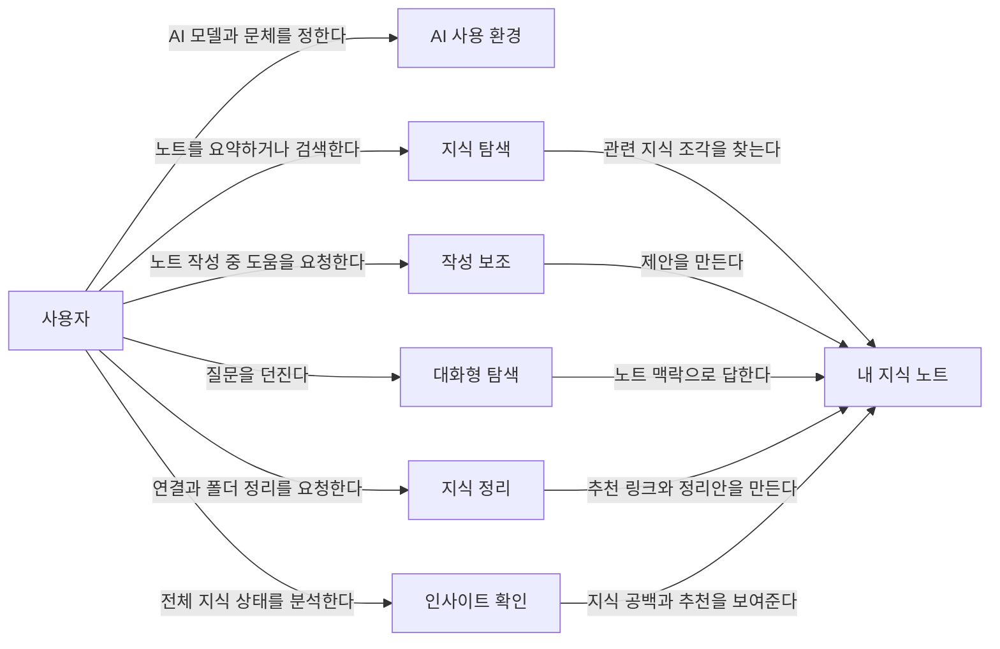
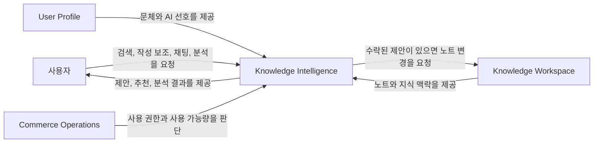

# Knowledge Intelligence Domain Flow

이 문서는 `src/main/resources/contracts/knowledge-intelligence.openapi.yaml`의 기능 범위를 바탕으로 Intelligence Service를 도메인 관점에서 설명한다. 기술 구현 방식이 아니라 사용자 행동, 도메인 사건, 도메인 간 관계를 정리하는 것이 목적이다.

## 1. Domain Storytelling

도메인 스토리텔링은 "누가, 무엇을 가지고, 어떤 행동을 하는지"를 순서대로 보여준다.

### 전체 사용자 흐름

### 핵심 이야기

1. 사용자는 먼저 AI 모델과 문체 프로필을 정해 개인화된 AI 사용 환경을 만든다.
2. 사용자는 노트 요약과 시맨틱 검색으로 필요한 지식을 빠르게 찾는다.
3. 사용자는 작성 중인 노트에서 요약, 재작성, 이어쓰기, 번역, 맞춤법 검사 도움을 받는다.
4. 사용자는 AI 제안을 수락하거나 거절하거나 다시 생성해 노트 작성 흐름을 통제한다.
5. 사용자는 채팅 스레드에서 자신의 지식 맥락을 바탕으로 질문하고 답변을 받는다.
6. 사용자는 관련 노트 링크와 징검다리 개념 추천으로 흩어진 지식을 연결한다.
7. 사용자는 폴더 정리 제안과 클러스터링 결과로 지식 구조를 재정리한다.
8. 사용자는 인사이트 리포트에서 지식 공백, 추천사항, 학습 제안을 확인한다.

## 2. Event Storming Process Matrix

이벤트 스토밍 관점에서는 사용자의 의도, 도메인에서 일어난 사건, 다음 반응을 분리해서 본다.

| 순서 | 사용자 의도 | 도메인 사건 | 다음 도메인 반응 |
| --- | --- | --- | --- |
| 1 | AI를 사용할 준비를 한다 | AI 모델 설정됨 | 이후 AI 응답은 선택된 모델과 사용자 설정을 따른다 |
| 2 | 내 문체를 반영하고 싶다 | 문체 프로필 설정됨 | 작성 보조와 생성형 응답이 사용자 문체를 참고한다 |
| 3 | 특정 지식을 찾고 싶다 | 시맨틱 검색 수행됨 | 관련 노트 후보와 검색 점수가 제공된다 |
| 4 | 노트 내용을 빠르게 이해하고 싶다 | 노트 요약 조회됨 | 사용자는 노트 전체를 열지 않고 핵심 내용을 파악한다 |
| 5 | 작성 중인 노트를 개선하고 싶다 | AI 제안 생성됨 | 사용자는 제안을 검토하고 수락, 거절, 재생성을 결정한다 |
| 6 | AI 제안을 반영하고 싶다 | AI 제안 결정 기록됨 | 수락된 제안은 노트 내용 변경 흐름으로 이어진다 |
| 7 | 내 지식 기반으로 질문하고 싶다 | 채팅 스레드 생성됨 | 질문과 답변을 이어갈 대화 공간이 생긴다 |
| 8 | 대화로 지식을 탐색한다 | 채팅 메시지 생성됨 | 노트 맥락을 바탕으로 답변이 생성된다 |
| 9 | 관련 노트를 연결하고 싶다 | 링크 추천 생성됨 | 사용자는 연결할 만한 노트 후보를 확인한다 |
| 10 | 떨어진 개념 사이를 잇고 싶다 | 징검다리 개념 추천됨 | 사용자는 두 노트를 이어 줄 중간 지식을 발견한다 |
| 11 | 지식 공간을 정리하고 싶다 | 폴더 정리 제안 생성됨 | 사용자는 추천 폴더 구조와 이동안을 검토한다 |
| 12 | 지식의 묶음을 알고 싶다 | 클러스터링 요청됨 | 분석 작업이 시작되고 결과 조회 대상으로 남는다 |
| 13 | 클러스터링 결과를 확인한다 | 클러스터링 결과 조회됨 | 사용자는 지식 묶음과 구조를 확인한다 |
| 14 | 전체 지식 상태를 알고 싶다 | 인사이트 리포트 요청됨 | 분석 작업이 시작되고 결과 조회 대상으로 남는다 |
| 15 | 학습 방향을 정하고 싶다 | 인사이트 리포트 조회됨 | 사용자는 지식 공백, 추천사항, 학습 제안을 확인한다 |

## 3. Context Map

컨텍스트 맵은 각 도메인이 어떤 책임을 갖고, 어느 도메인이 다른 도메인의 판단에 영향을 주는지 보여준다.

## 관계 해석

- `Knowledge Intelligence`는 사용자의 지식 활용 경험을 만든다.
- `Knowledge Workspace`는 노트와 지식 맥락의 기준이 되는 도메인이다.
- `Commerce Operations`는 AI 기능을 사용할 수 있는지, 사용량을 인정할 수 있는지 판단한다.
- `User Profile`은 문체와 AI 선호처럼 개인화에 필요한 정보를 제공한다.
- 사용자는 최종적으로 제안, 추천, 분석 결과를 검토하고 선택한다.

## 도메인 구현 순서와의 연결

이 문서의 흐름은 `vaults/agents/domain-implementation-order.md`의 기능 구현 순서와 연결된다.

1. AI 사용 준비
2. 지식 탐색 기본 기능
3. 노트 작성 보조
4. RAG 채팅
5. 노트 연결 추천
6. 지식 정리 제안
7. 지식 구조 분석
8. 고급 인사이트
