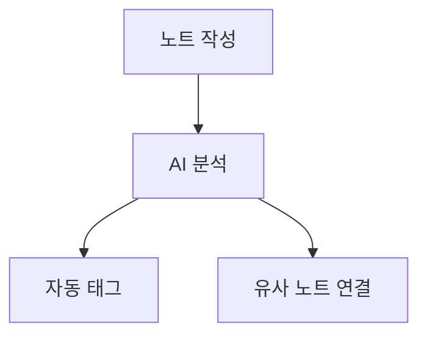

# BrainX — 노트 작성 기능 최종 명세

> 기준: TipTap v3 (ProseMirror 기반) · Notion · Obsidian 기능 교차 검토  
> 데모 화면 분석 반영 (메인 에디터 + Editor Lab 화면)  
> 3주 5인 MVP 기준 우선순위 포함

---

## 목차

1. [툴바 구성](#1-툴바-구성)
2. [텍스트 서식](#2-텍스트-서식)
3. [폰트 & 타이포그래피](#3-폰트--타이포그래피)
4. [색상 — 글씨 색상 & 형광펜](#4-색상--글씨-색상--형광펜)
5. [제목 & 문단 구조](#5-제목--문단-구조)
6. [목록](#6-목록)
7. [링크 & 참조](#7-링크--참조)
8. [코드 & 수식](#8-코드--수식)
9. [테이블](#9-테이블)
10. [미디어 & 임베드](#10-미디어--임베드)
11. [슬래시 커맨드](#11-슬래시-커맨드)
12. [화면 분할 (Split View)](#12-화면-분할-split-view)
13. [에디터 모드](#13-에디터-모드)
14. [Obsidian 핵심 기능](#14-obsidian-핵심-기능)
    - 14-8. [접기 / 펼치기 (Folding)](#14-8-접기--펼치기-folding)
    - 14-9. [들여쓰기 가이드 라인 (Indent Guide)](#14-9-들여쓰기-가이드-라인-indent-guide)
15. [우측 사이드바 패널](#15-우측-사이드바-패널)
16. [상단 액션바](#16-상단-액션바)
17. [노트 메타정보](#17-노트-메타정보)
18. [자동저장 & 히스토리](#18-자동저장--히스토리)
19. [단축키 전체 목록](#19-단축키-전체-목록)
20. [TipTap 패키지 매핑](#20-tiptap-패키지-매핑)
21. [MVP 우선순위 표](#21-mvp-우선순위-표)

---

## 1. 툴바 구성

### 1-1. 데모 기준 확인된 툴바 버튼

```
[ B ] [ / ] [ H1 ] [ H2 ] [ H3 ] [ • ] [ — ] [ 1. ]
[작게] [보통▼] [크게] [매우 크게] [보통(16px)] [편집] [미리보기] [JSON] [✓저장됨]
```

- `B` — Bold
- `/` — 슬래시 커맨드 팝업 트리거
- `H1` `H2` `H3` — 헤딩
- `•` — 불릿 목록
- `—` — 구분선
- `1.` — 순서 목록
- `작게 / 보통 / 크게 / 매우 크게` — 폰트 크기 프리셋
- `편집 / 미리보기` — 에디터 모드 전환
- `JSON` — 에디터 내부 JSON 확인 (개발용)
- `✓ 저장됨` — 자동저장 상태 표시

### 1-2. 추가되어야 할 툴바 버튼

```
[ I ] [ U ] [ S ] [ `코드` ]
[ A색상 ] [ 형광펜 ] [ 하이퍼링크 ]
[ 정렬: 좌|중|우|양쪽 ]
[ 인용구 ] [ 콜아웃 ] [ 체크박스 ]
[ 이미지 ] [ 테이블 ]
```

### 1-3. 툴바 UX 원칙

- 텍스트 드래그 선택 시 **버블 툴바(Floating Toolbar)** 자동 표시
  - Bold / Italic / Underline / Strike / 코드 / 링크 / 색상 / 형광펜 / AI 액션
- 고정 툴바는 에디터 상단에 항상 표시
- 모바일에서는 하단 고정 툴바로 전환

---

## 2. 텍스트 서식

### 2-1. 기본 인라인 서식

| 기능 | 단축키 | TipTap 확장 |
|------|--------|-------------|
| **Bold** (굵게) | Ctrl+B | `@tiptap/extension-bold` |
| *Italic* (기울임) | Ctrl+I | `@tiptap/extension-italic` |
| <u>Underline</u> (밑줄) | Ctrl+U | `@tiptap/extension-underline` |
| ~~Strike~~ (취소선) | Ctrl+Shift+X | `@tiptap/extension-strike` |
| `Inline Code` (인라인 코드) | Ctrl+E | `@tiptap/extension-code` |
| X² Superscript (위첨자) | — | `@tiptap/extension-superscript` |
| X₂ Subscript (아래첨자) | — | `@tiptap/extension-subscript` |

### 2-2. 텍스트 정렬

| 정렬 | 단축키 |
|------|--------|
| 왼쪽 정렬 | Ctrl+Shift+L |
| 가운데 정렬 | Ctrl+Shift+E |
| 오른쪽 정렬 | Ctrl+Shift+R |
| 양쪽 정렬 | Ctrl+Shift+J |

TipTap 확장: `@tiptap/extension-text-align`

---

## 3. 폰트 & 타이포그래피

### 3-1. 폰트 크기 변경

> 데모에서 `작게 / 보통(16px) / 크게 / 매우 크게` 프리셋 버튼 확인됨

**프리셋 방식 (툴바 버튼)**

| 버튼 | 실제 크기 |
|------|-----------|
| 작게 | 12px |
| 보통 (기본값) | 16px |
| 크게 | 20px |
| 매우 크게 | 24px |

**드롭다운 방식 (세부 조절)**

```
12 / 13 / 14 / 15 / 16 / 18 / 20 / 24 / 28 / 32 / 36 / 48px
```

- 선택한 텍스트에만 적용 (인라인)
- 에디터 전체 기본 크기 설정 (설정 메뉴)

TipTap 확장: `@tiptap/extension-font-size`

### 3-2. 폰트 패밀리

```
Pretendard (기본)
Noto Sans KR
Nanum Gothic
Spoqa Han Sans Neo
D2Coding (코드용 모노)
Times New Roman (Serif)
```

TipTap 확장: `@tiptap/extension-font-family`

### 3-3. 줄간격

```
1.0 / 1.25 / 1.5 (기본) / 1.75 / 2.0
```

---

## 4. 색상 — 글씨 색상 & 형광펜

### 4-1. 글씨 색상 (Text Color)

```
기본 팔레트 (16색)
├── 검정 / 회색 계열: #000000, #374151, #6B7280, #9CA3AF
├── 빨강 계열: #EF4444, #DC2626
├── 주황: #F97316
├── 노랑: #EAB308
├── 초록 계열: #22C55E, #16A34A
├── 파랑 계열: #3B82F6, #2563EB
├── 보라 계열: #8B5CF6, #7C3AED
├── 분홍: #EC4899
└── 커스텀 색상 (hex 직접 입력)
```

- 텍스트 선택 후 색상 피커 표시
- 최근 사용 색상 5개 빠른 접근
- 기본 색상으로 초기화 버튼

TipTap 확장: `@tiptap/extension-color`

### 4-2. 형광펜 (Highlight / Background Color)

```
형광 팔레트 (8색)
├── 노랑 형광: #FEF08A  ← 기본
├── 초록 형광: #BBF7D0
├── 파랑 형광: #BAE6FD
├── 보라 형광: #E9D5FF
├── 분홍 형광: #FBCFE8
├── 주황 형광: #FED7AA
├── 회색 형광: #E5E7EB
└── 빨강 형광: #FECACA
```

- 다크모드에서 형광 색상 자동 채도 조정
- 단축키: Ctrl+Shift+H

TipTap 확장: `@tiptap/extension-highlight`

```typescript
// 설정 예시
Highlight.configure({
  multicolor: true, // 여러 색상 지원
})
```

---

## 5. 제목 & 문단 구조

### 5-1. 헤딩

```
H1 ~ H6 (단축키: Ctrl+Alt+1 ~ 6)
```

- 헤딩 앞 `#` 입력 → 마크다운 단축키 자동 변환
- 헤딩 클릭 시 좌측에 앵커 링크(🔗) 표시
- TOC(목차)에 H1~H3 자동 반영

### 5-2. 인용구 (Blockquote)

```
> 인용 텍스트
```

- 단축키: Ctrl+Shift+B
- 중첩 인용 지원 (최대 3단계)
- 인용 출처 표시 옵션

### 5-3. 콜아웃 박스 (Callout)

```
📘 Info     — 파란색 배경
⚠️ Warning  — 노란색 배경
❌ Error    — 빨간색 배경
✅ Success  — 초록색 배경
📝 Note     — 회색 배경
💡 Tip      — 연두색 배경
```

- 아이콘 변경 가능 (이모지 선택)
- 제목 + 본문 구조
- 슬래시 커맨드 `/callout`으로 삽입

### 5-4. 구분선

```
---  또는 툴바 버튼
```

---

## 6. 목록

### 6-1. 불릿 목록 (Bullet List)

```
- 항목 1
  - 중첩 항목 (Tab)
    - 3단계 중첩
```

- 단축키: Ctrl+Shift+8
- 들여쓰기: Tab / 내어쓰기: Shift+Tab
- 최대 6단계 중첩

### 6-2. 순서 목록 (Ordered List)

```
1. 항목 1
2. 항목 2
   1. 중첩
```

- 단축키: Ctrl+Shift+7
- 시작 번호 지정 가능
- 스타일: 숫자(1.) / 알파벳(a.) / 로마자(i.)

### 6-3. 체크박스 목록 (Task List) — Obsidian 스타일

```
- [ ] 미완료 항목
- [x] 완료 항목
```

- 클릭으로 완료/미완료 토글
- 완료 시 취소선 자동 적용
- 완료율 표시 옵션 (진행 바)
- 단축키: Ctrl+Shift+9

TipTap 확장: `@tiptap/extension-task-list` + `@tiptap/extension-task-item`

---

## 7. 링크 & 참조

### 7-1. 하이퍼링크 (External Link)

- 단축키: Ctrl+K
- 텍스트 선택 → Ctrl+K → URL 입력 팝업
- 입력 항목:
  - URL (필수)
  - 표시 텍스트 (선택)
  - 새 탭에서 열기 옵션 (체크박스)
- 링크 위에 마우스 올리면 미리보기 툴팁 (URL + 편집/제거 버튼)
- Open Graph 기반 링크 카드 변환 옵션

TipTap 확장: `@tiptap/extension-link`

```typescript
Link.configure({
  openOnClick: false,     // 편집 중 클릭 방지
  autolink: true,         // URL 자동 감지 → 링크 변환
  HTMLAttributes: {
    target: '_blank',
    rel: 'noopener noreferrer',
  },
})
```

### 7-2. 위키링크 (Wiki Link) — Obsidian 스타일

```
[[노트 제목]]
[[노트 제목|표시 이름]]
[[노트 제목#헤딩]]
```

- `[[` 입력 시 자동완성 드롭다운
- 존재하지 않는 노트: 점선 표시 → 클릭 시 새 노트 생성
- 존재하는 노트: 클릭 → 해당 노트로 이동
- 별칭(Alias) 지원

TipTap 커스텀 확장 필요 (ProseMirror NodeView 활용)

### 7-3. 멘션 (@Mention)

```
@사용자명  → 워크스페이스 내 팀원 멘션
@노트제목  → 노트 링크 (위키링크 대안)
```

- `@` 입력 시 자동완성 드롭다운

TipTap 확장: `@tiptap/extension-mention`

### 7-4. 각주 (Footnote)

```
본문 텍스트[^1]

[^1]: 각주 내용
```

- 각주 번호 자동 부여
- 각주 클릭 → 페이지 하단 각주로 스크롤

---

## 8. 코드 & 수식

### 8-1. 코드 블록 — 코드 하이라이팅

**지원 언어 (50+)**

```
웹:         JavaScript, TypeScript, HTML, CSS, SCSS, JSON, XML
백엔드:     Java, Python, Go, Rust, C, C++, C#, PHP, Ruby, Kotlin, Swift
데이터:     SQL, GraphQL, YAML, TOML, CSV
인프라:     Bash, Shell, Dockerfile, Nginx, Terraform
기타:       Markdown, LaTeX, R, Scala, Dart, Lua
```

**코드 블록 UI**

```
┌─ javascript ──────────────────── [복사] ─┐
│  1  const hello = () => {               │
│  2    console.log("Hello, BrainX!");    │  ← 줄 번호
│  3  }                                   │
└─────────────────────────────────────────┘
```

- 언어 배지 (좌상단)
- 줄 번호 표시/숨김 토글
- 우상단 복사 버튼 (클릭 시 "복사됨!" 피드백)
- 특정 줄 하이라이트 (주석으로 지정)
- 다크 / 라이트 테마 자동 연동
- 탭 크기 설정 (2칸 / 4칸)

TipTap 확장:
```typescript
import { lowlight } from 'lowlight'
import CodeBlockLowlight from '@tiptap/extension-code-block-lowlight'

CodeBlockLowlight.configure({
  lowlight,
  defaultLanguage: 'plaintext',
  HTMLAttributes: {
    class: 'code-block',
  },
})
```

### 8-2. 인라인 코드

```
`코드` 형식
```

- 백틱 1개로 감싸기
- 단축키: Ctrl+E

### 8-3. 수식 (Math)

```
인라인: $E = mc^2$
블록:
$$
\sum_{i=1}^{n} x_i = \bar{x} \cdot n
$$
```

- KaTeX 렌더링
- 실시간 미리보기

TipTap 확장: `@aarkue/tiptap-math-extension` 또는 커스텀

---

## 9. 테이블

### 9-1. 삽입 & 편집

- 슬래시 커맨드 `/table` → 행/열 수 선택 (그리드 UI)
- 최소 2×2, 최대 20×20

### 9-2. 테이블 조작

```
행/열 추가     — 우클릭 메뉴 또는 +버튼
행/열 삭제     — 우클릭 메뉴
셀 병합        — 여러 셀 선택 → 병합
셀 분리        — 병합된 셀 분리
헤더 행 토글   — 첫 행을 헤더로 지정
열 너비 조절   — 드래그
```

### 9-3. 셀 내 서식

- Bold / Italic / 코드 / 링크 모두 셀 내에서 사용 가능
- 셀 내 이미지 삽입

### 9-4. 열 정렬

```
왼쪽 / 가운데 / 오른쪽 정렬
```

TipTap 확장: `@tiptap/extension-table` + `@tiptap/extension-table-row` + `@tiptap/extension-table-header` + `@tiptap/extension-table-cell`

---

## 10. 미디어 & 임베드

### 10-1. 이미지

```
삽입 방법
├── 로컬 파일 업로드 (파일 선택 다이얼로그)
├── 드래그 앤 드롭
├── 클립보드 붙여넣기 (Ctrl+V)
└── URL 직접 입력
```

**이미지 편집 옵션**

```
크기 조절    — 모서리 핸들 드래그 (비율 유지 옵션)
정렬         — 왼쪽 / 가운데 / 오른쪽 / 전체 너비
캡션         — 이미지 하단 텍스트 입력
Alt 텍스트   — 접근성
링크 연결    — 이미지 클릭 시 URL 이동
```

### 10-2. 파일 첨부

```
지원 형식    — PDF, Word, Excel, PPT, ZIP 등
표시 방식    — 파일 카드 (아이콘 + 파일명 + 크기)
PDF         — 인라인 미리보기 (페이지 수 표시)
다운로드    — 카드 우측 다운로드 버튼
```

### 10-3. 링크 카드 (URL Unfurl)

```
URL 붙여넣기 시 → "링크 카드로 변환?" 물어봄
├── Open Graph 메타 파싱 (og:title, og:description, og:image)
├── 카드 형식: 사이트 파비콘 + 제목 + 설명 + 이미지
└── 일반 링크로 유지 선택지도 제공
```

### 10-4. 임베드

```
YouTube     — URL 붙여넣기 → 인라인 영상 플레이어
Vimeo       — 동일
Twitter/X   — 트윗 카드 임베드
GitHub      — Gist 코드 임베드
Figma       — 프레임 미리보기
Mermaid     — 다이어그램 코드 → 시각화
```

### 10-5. Mermaid 다이어그램

````

````

- 코드 편집 + 우측 실시간 미리보기
- 지원: Flowchart / Sequence / Gantt / Class / ER / State / Pie

---

## 11. 슬래시 커맨드

> 데모에서 확인: `/ 명령어: 요약, 체크리스트, 코드블록, AI로 이어쓰기`

에디터 본문에서 `/` 입력 시 팝업 메뉴 표시

### 11-1. 기본 블록

```
/h1  /h2  /h3  /h4  /h5  /h6   — 헤딩
/text                            — 기본 단락
/bullet       또는 /ul           — 불릿 목록
/numbered     또는 /ol           — 순서 목록
/todo         또는 /check        — 체크박스
/quote        또는 /blockquote   — 인용구
/divider      또는 /hr           — 구분선
/callout                         — 콜아웃 박스
```

### 11-2. 미디어 & 데이터

```
/image                           — 이미지 삽입
/file                            — 파일 첨부
/table                           — 테이블
/code                            — 코드 블록 (언어 선택)
/math                            — 수식 블록
/mermaid                         — 다이어그램
/embed                           — URL 임베드
/youtube                         — YouTube 임베드
```

### 11-3. Obsidian 기능

```
/link         또는 [[            — 위키링크 (노트 내부 링크)
/tag                             — 태그 삽입
/toc                             — 목차 자동 생성
/date                            — 오늘 날짜 삽입
/daily                           — 데일리 노트 이동
```

### 11-4. AI 명령 (3주차)

```
/ai           — AI 명령 팝업
/요약                            — 현재 노트 AI 요약
/번역                            — 선택 텍스트 번역
/이어쓰기     또는 /continue     — 커서 위치에서 AI 자동 완성
/체크리스트                      — 현재 내용 기반 할 일 목록 생성
/설명추가                        — 선택 텍스트 설명 확장
/태그추천                        — AI 태그 추천
```

---

## 12. 화면 분할 (Split View)

### 12-1. 분할 모드 종류

```
┌──────────────────────────────────────┐
│ 편집 + 미리보기  (기본, Typora 스타일) │
│ ┌────────────┬────────────┐          │
│ │  Markdown  │  Preview   │          │
│ │  편집기    │  렌더링    │          │
│ └────────────┴────────────┘          │
└──────────────────────────────────────┘

┌──────────────────────────────────────┐
│ 노트 + 노트  (Obsidian 스타일)        │
│ ┌────────────┬────────────┐          │
│ │  노트 A    │  노트 B    │          │
│ │            │            │          │
│ └────────────┴────────────┘          │
└──────────────────────────────────────┘

┌──────────────────────────────────────┐
│ 상하 분할                            │
│ ┌────────────────────────┐           │
│ │        노트 A          │           │
│ ├────────────────────────┤           │
│ │        노트 B          │           │
│ └────────────────────────┘           │
└──────────────────────────────────────┘

┌──────────────────────────────────────┐
│ 4분할 (최대)                         │
│ ┌────────┬────────┐                  │
│ │ A      │ B      │                  │
│ ├────────┼────────┤                  │
│ │ C      │ D      │                  │
│ └────────┴────────┘                  │
└──────────────────────────────────────┘
```

### 12-2. 패널 동작

```
패널 비율 조절     — 중간 구분선 드래그 (min 20%, max 80%)
패널 닫기          — 패널 우상단 X 버튼
패널 최대화        — 패널 우상단 □ 버튼 (임시)
패널 간 노트 이동  — 노트 탭 다른 패널로 드래그
같은 노트 양쪽     — 편집(좌) + 읽기전용(우) 동시 열기
```

### 12-3. 편집 / 미리보기 분할 상세

```
스크롤 동기화     — 편집 위치 ↔ 미리보기 위치 실시간 연동
미리보기 새로고침 — 실시간 (debounce 300ms)
미리보기 전용 기능
  ├── 헤딩 앵커 링크 활성화
  ├── 위키링크 클릭 가능
  └── 체크박스 클릭 가능 (편집 모드로 상태 반영)
```

### 12-4. 단축키

```
Ctrl+\          — 좌우 분할
Ctrl+Shift+\    — 상하 분할
Ctrl+W          — 현재 패널 닫기
Ctrl+Shift+F    — 현재 패널 최대화 토글
```

---

## 13. 에디터 모드

### 13-1. 모드 목록

```
WYSIWYG 모드 (기본)
├── TipTap 리치 에디터
├── 마크다운 단축키 지원 (## → H2 자동 변환 등)
└── 렌더링된 결과 즉시 표시

Source Mode (소스 모드)
├── 순수 Markdown 텍스트 편집
├── CodeMirror 기반 에디터
└── 구문 하이라이팅 (Markdown)

Reading Mode (읽기 모드)
├── 편집 불가 (읽기 전용)
├── 클린한 렌더링 뷰
└── 공유 링크 기본 모드

Zen Mode (집중 모드)
├── 전체 화면 전환
├── 좌우 사이드바 모두 숨김
├── 에디터 중앙 정렬 (최대 너비 800px)
└── 단축키: F11 또는 Ctrl+Shift+Z
```

### 13-2. 데모 기준 모드 전환 UI

```
툴바 우측: [편집] [미리보기] [JSON]
상단 우측: [🌙 Dark] [실험용·백엔드 미연결]
```

---

## 14. Obsidian 핵심 기능

### 14-1. 내부 링크 (Wiki Link)

```
[[노트 제목]]                    — 기본 링크
[[노트 제목|별칭]]               — 별칭 표시
[[노트 제목#헤딩]]               — 특정 섹션 링크
[[노트 제목#헤딩|별칭]]          — 섹션 + 별칭
```

**자동완성 UX**
- `[[` 입력 시 즉시 드롭다운 표시
- 노트 이름 퍼지 검색 (오타 허용)
- 존재하지 않는 노트: 주황색 점선 → 클릭 시 "새 노트 만들기" 확인
- 존재하는 노트: 파란색 → 클릭 시 이동

### 14-2. 백링크 (Backlinks)

우측 사이드바 "연결·백링크" 패널

```
현재 노트를 참조하는 노트 목록
├── 노트 제목
├── 참조 문맥 미리보기 (앞뒤 30자)
├── 참조 횟수 배지
└── 클릭 → 해당 노트 열기

미연결 언급 (Unlinked Mentions)
├── [[링크]] 없이 노트 제목만 언급한 케이스
└── "링크로 변환" 원클릭 버튼
```

### 14-3. 태그 시스템

```
인라인 태그: #태그이름
계층 태그:   #프로젝트/BrainX/기획
```

- `#` 입력 시 기존 태그 자동완성 드롭다운
- 태그 클릭 → 해당 태그 노트 필터링
- 좌측 사이드바 태그 패널 (태그 클라우드)
- AI 자동 태그 추천 (우측 패널)

### 14-4. YAML Frontmatter

```yaml
---
title: 노트 제목
created: 2025-01-01T09:00:00
updated: 2025-01-15T14:30:00
tags: [ai, rag, knowledge-management]
aliases: [별칭1, 별칭2]
status: draft | in-progress | done | archived
pinned: true
cover: /images/cover.jpg
---
```

- 노트 상단 `Properties` 패널 (Notion 스타일 폼 UI)
- 코드 형식 ↔ 폼 형식 전환 토글
- 커스텀 필드 추가 가능 (키-값 자유 입력)
- 날짜 필드: 날짜 피커 UI

### 14-5. 지식 그래프

```
전체 그래프 뷰 (/graph 라우트)
├── 노드: 각 노트 (크기 = 연결 수)
├── 엣지: 위키링크
├── 색상: 태그별 구분
├── 검색: 특정 노드 하이라이트
├── 필터: 태그 / 폴더 / 날짜
└── 줌 & 드래그

로컬 그래프 (우측 사이드바)
├── 현재 노트 중심
├── Depth: 1~3 조절 슬라이더
└── 클릭 → 해당 노트 열기
```

### 14-6. 데일리 노트

```
오늘 날짜 노트 자동 생성 (형식: YYYY-MM-DD.md)
├── 좌측 사이드바 캘린더 위젯
├── 날짜 클릭 → 해당 날짜 노트 생성/열기
├── 템플릿 적용 (설정에서 지정)
└── 주간 노트 연장 옵션
```

### 14-7. 북마크 & 즐겨찾기

```
노트 즐겨찾기   — ⭐ 토글 (우클릭 메뉴 or 툴바)
섹션 북마크     — 특정 헤딩에 북마크 추가
빠른 접근       — 좌측 사이드바 즐겨찾기 패널 (상단 고정)
```

---

### 14-8. 접기 / 펼치기 (Folding)

> Obsidian의 "헤딩 / 목록 Fold" 기능.  
> 제목(H1~H6) 또는 목록 항목 옆 화살표를 클릭하면 하위 내용 전체를 접거나 펼칠 수 있다.

#### 헤딩 Folding

```
## 2. 핵심 개념  ▼  ← 화살표 클릭 → 접힘
  내용이 여기 있습니다...
  ### 2-1. 세부 개념  ▼
    세부 내용...

접힌 상태:
## 2. 핵심 개념  ▶  (하위 내용 숨김)
```

**동작 상세**

```
트리거
├── 헤딩 왼쪽 삼각형 화살표(▶/▼) 클릭
├── 단축키: Ctrl+Shift+[ (현재 헤딩 접기)
├── 단축키: Ctrl+Shift+] (현재 헤딩 펼치기)
├── 단축키: Ctrl+Shift+, (전체 접기)
└── 단축키: Ctrl+Shift+. (전체 펼치기)

범위
├── 해당 헤딩 레벨 기준으로 하위 모든 내용 포함
├── H2 접으면 → 그 H2 아래 H3, H4, 본문 전부 숨김
├── H3 접으면 → 그 H3 아래 내용만 숨김 (부모 H2는 유지)
└── 중첩 접기 가능 (H2 펼친 상태에서 하위 H3는 접힌 상태 유지)

상태 유지
├── 노트 이동 후 돌아와도 접힌 상태 복원
├── localStorage 또는 서버에 fold 상태 저장
└── "모두 펼치기" 버튼 (우측 상단 툴바)
```

#### 목록 Folding

```
- 부모 항목  ▼
  - 자식 1
  - 자식 2
    - 손자 항목

접힌 상태:
- 부모 항목  ▶  (자식 항목 숨김)
```

**동작 상세**

```
트리거
├── 자식이 있는 목록 항목 왼쪽 화살표 클릭
├── 자식 없는 항목은 화살표 미표시
└── 단축키: Tab 위치에서 Ctrl+클릭

적용 범위
├── 불릿 목록 (BulletList)
├── 순서 목록 (OrderedList)
└── 체크박스 목록 (TaskList)
```

#### TipTap 구현 방법

```typescript
// 방법 1: @tiptap/extension-bullet-list 커스텀 확장
// NodeView를 활용해 헤딩/목록 노드에 fold 상태 attribute 추가

// 방법 2: Heading에 fold attribute 추가
const FoldableHeading = Heading.extend({
  addAttributes() {
    return {
      ...this.parent?.(),
      folded: {
        default: false,
        parseHTML: el => el.getAttribute('data-folded') === 'true',
        renderHTML: attrs => ({ 'data-folded': attrs.folded }),
      },
    }
  },
  // NodeView에서 fold 토글 화살표 렌더링
})

// 방법 3: CodeMirror 방식 참고한 커스텀 ProseMirror 플러그인
// → 성능 상 가장 권장 (대용량 노트 대응)
```

> **MVP 구현 팁**: 헤딩 Folding만 먼저 구현하고, 목록 Folding은 2주차 이후로 분리해도 무방하다.

---

### 14-9. 들여쓰기 가이드 라인 (Indent Guide)

> VS Code / Obsidian의 코드 인덴트 세로줄처럼,  
> 문서 목록의 들여쓰기 깊이를 세로 점선 또는 실선으로 시각화한다.

#### 시각적 표현

```
- 1단계 항목
│  - 2단계 항목        ← 세로줄 1개
│  │  - 3단계 항목     ← 세로줄 2개
│  │  │  - 4단계 항목  ← 세로줄 3개
│  │  - 3단계 다른 항목
│  - 2단계 다른 항목
- 1단계 다른 항목
```

**실제 렌더링 예시 (CSS 기반)**

```
•  상위 항목
   ┆  •  하위 항목 A        ← 세로 가이드라인 (┆)
   ┆     •  더 하위 항목    ← 두 번째 가이드라인
   ┆  •  하위 항목 B
•  다른 상위 항목
```

#### 디자인 스펙

```
색상
├── 라이트 모드: rgba(0, 0, 0, 0.12)  — 연한 회색 실선
├── 다크 모드:  rgba(255, 255, 255, 0.12) — 연한 흰색 실선
└── hover 시:  rgba(주색상, 0.4)      — 해당 depth 라인 강조

스타일
├── 기본: 실선 1px
├── 옵션: 점선 (1px dashed)
└── 설정에서 변경 가능

간격
├── 들여쓰기 1단계 = 24px (기본)
└── 설정에서 16 / 20 / 24 / 28px 선택 가능
```

#### 적용 범위

```
적용 O
├── 불릿 목록 (BulletList) 중첩
├── 순서 목록 (OrderedList) 중첩
├── 체크박스 목록 (TaskList) 중첩
└── 헤딩 하위 콘텐츠 (Folding과 연계)

적용 X
├── 코드 블록 내부 (코드는 자체 인덴트 스타일 사용)
└── 테이블 셀 내부
```

#### TipTap / CSS 구현 방법

```css
/* CSS만으로 구현 가능 (가장 간단) */

/* 중첩 목록 컨테이너에 세로줄 */
.tiptap ul ul,
.tiptap ol ol,
.tiptap ul ol,
.tiptap ol ul {
  border-left: 1px solid rgba(0, 0, 0, 0.12);
  margin-left: 0;
  padding-left: 24px;
  position: relative;
}

/* 다크 모드 */
.dark .tiptap ul ul,
.dark .tiptap ol ol {
  border-left: 1px solid rgba(255, 255, 255, 0.12);
}

/* hover 시 해당 depth 강조 */
.tiptap li:hover > ul,
.tiptap li:hover > ol {
  border-left-color: rgba(99, 102, 241, 0.5); /* indigo */
}
```

```typescript
// 더 정밀한 제어가 필요한 경우 — TipTap NodeView 활용
// 각 ListItem의 depth를 계산해 data-depth attribute 부여
const IndentGuideListItem = ListItem.extend({
  addAttributes() {
    return {
      ...this.parent?.(),
      depth: { default: 0 },
    }
  },
})
// → CSS에서 [data-depth="1"], [data-depth="2"] 별도 스타일링
```

> **MVP 구현 팁**: CSS 방식으로만 구현해도 충분하다.  
> TipTap NodeView 방식은 hover 강조 등 인터랙티브 효과가 필요할 때 사용한다.

---

## 15. 우측 사이드바 패널

> 데모 기준 확인된 패널 4개

### 15-1. 목차 (Table of Contents)

```
├── H1 ~ H3 자동 추출
├── 계층 들여쓰기 표시
├── 현재 스크롤 위치 하이라이트
└── 클릭 → 해당 섹션으로 스크롤
```

### 15-2. 연결 · 백링크

```
[연결] 탭
├── 이 노트에서 링크하는 노트 목록 (Outgoing)
└── 이 노트를 링크하는 노트 목록 (Incoming / Backlinks)

[미연결 언급] 탭
└── 링크 없이 제목만 언급된 노트
```

### 15-3. AI 연결 제안

```
저장 시 백그라운드 작동
├── 유사도 높은 노트 Top 3~5
├── 유사도 퍼센트 표시 (85% 일치)
├── 관련 문맥 미리보기
└── "연결 추가" → [[위키링크]] 자동 삽입
```

### 15-4. 인라인 AI 채팅

```
데모: "이 노트에 대해 무엇이든 물어보세요."
├── 현재 노트 컨텍스트 기반 Q&A
├── RAG 연동 (관련 노트 함께 검색)
├── 출처 노트 인용 표시
└── 대화 히스토리 유지 (세션 동안)
```

### 15-5. 노트 속성 (Properties)

```
├── YAML Frontmatter 폼 UI
├── 생성일 / 수정일 (자동)
├── 태그 관리
├── 상태 (draft / done 등)
└── 커스텀 필드
```

---

## 16. 상단 액션바

> 데모 기준: `✓ 저장됨 | 업로드 | PDF | TXT | MD | 🔗 공유 링크 | 🗑`

```
[✓ 저장됨]    — 자동저장 상태 (저장 중 스피너 → 저장됨 체크)
[업로드]      — 파일 첨부 (이미지, PDF, 기타)
[PDF]         — 현재 노트 PDF 내보내기
[TXT]         — 텍스트 파일 내보내기
[MD]          — Markdown 파일 내보내기
[🔗 공유 링크] — 공개 링크 생성 / 관리
[🗑 삭제]     — 노트 삭제 (휴지통 이동, 30일 보관)
```

**추가 제안**

```
[···더보기]
├── 복제 (Duplicate)
├── 버전 히스토리
├── 이동 (폴더 선택)
├── 즐겨찾기 토글
└── 단어 수 / 읽기 시간
```

---

## 17. 노트 메타정보

> 데모 기준: `● 머신러닝` 태그 · `방금 수정` · `80 단어`

```
제목 하단 표시 항목
├── 태그 목록 (클릭 가능, + 버튼으로 추가)
├── 마지막 수정 시간 (상대시간: "방금", "3분 전", "2025-01-15")
├── 단어 수 실시간 카운터
├── 읽기 예상 시간 (단어 수 / 200 = 분)
├── 문자 수 (글자 수 카운터)
└── 생성일 (hover 시 전체 날짜 표시)
```

---

## 18. 자동저장 & 히스토리

### 18-1. 자동저장

```
트리거
├── 타이핑 중단 500ms 후 자동 저장 (debounce)
├── 에디터 포커스 잃을 때
├── 브라우저 탭 변경 / 닫을 때
└── Ctrl+S 수동 저장

상태 표시
├── 저장 중: 스피너 + "저장 중..."
├── 저장됨: ✓ + "저장됨"
└── 저장 실패: ⚠ + "저장 실패 - 재시도"
```

### 18-2. 버전 히스토리

```
├── 최대 100개 버전 보관
├── 버전 목록: 날짜 + 시간 + 변경 크기
├── 버전 클릭 → 해당 시점 내용 미리보기
├── diff 뷰 (변경 전후 비교, 추가=초록, 삭제=빨강)
└── "이 버전으로 복원" 버튼
```

### 18-3. 휴지통

```
├── 삭제 시 즉시 삭제 아님 → 휴지통 이동
├── 30일 후 자동 영구 삭제
├── 복원: 원래 위치 또는 위치 선택
└── 영구 삭제: 명시적 확인 필요
```

---

## 19. 단축키 전체 목록

### 서식

| 단축키 | 기능 |
|--------|------|
| Ctrl+B | Bold |
| Ctrl+I | Italic |
| Ctrl+U | Underline |
| Ctrl+Shift+X | Strikethrough |
| Ctrl+E | Inline Code |
| Ctrl+K | 하이퍼링크 삽입 |
| Ctrl+Shift+H | 형광펜 |
| Ctrl+Shift+C | 글씨 색상 피커 |

### 구조

| 단축키 | 기능 |
|--------|------|
| Ctrl+Alt+1~6 | 헤딩 H1~H6 |
| Ctrl+Shift+8 | 불릿 목록 |
| Ctrl+Shift+7 | 순서 목록 |
| Ctrl+Shift+9 | 체크박스 목록 |
| Ctrl+Shift+B | 인용구 |
| Tab | 들여쓰기 |
| Shift+Tab | 내어쓰기 |

### 에디터

| 단축키 | 기능 |
|--------|------|
| Ctrl+S | 수동 저장 |
| Ctrl+Z | 실행 취소 |
| Ctrl+Shift+Z | 다시 실행 |
| Ctrl+A | 전체 선택 |
| Ctrl+F | 노트 내 검색 |
| Ctrl+H | 찾기 & 바꾸기 |
| Ctrl+P | 커맨드 팔레트 |
| Ctrl+O | 빠른 노트 스위처 |
| Ctrl+Shift+F | 전체 검색 |
| Ctrl+\ | 좌우 화면 분할 |
| Ctrl+Shift+\ | 상하 화면 분할 |
| Ctrl+W | 현재 패널 닫기 |
| F11 | Zen Mode 토글 |

### 마크다운 단축키 (자동 변환)

| 입력 | 변환 결과 |
|------|-----------|
| `## ` + Space | H2 헤딩 |
| `- ` + Space | 불릿 목록 |
| `1. ` + Space | 순서 목록 |
| `[ ] ` + Space | 체크박스 |
| `> ` + Space | 인용구 |
| ` ``` ` + Enter | 코드 블록 |
| `---` + Enter | 구분선 |
| `[[` | 위키링크 자동완성 |
| `**텍스트**` | Bold |
| `*텍스트*` | Italic |

---

## 20. TipTap 패키지 매핑

```typescript
// 필수 (1주차)
import StarterKit from '@tiptap/starter-kit'
// Bold, Italic, Strike, Code, CodeBlock,
// Heading, BulletList, OrderedList, Blockquote,
// HorizontalRule, HardBreak, History 포함

// 인라인 서식
import Underline from '@tiptap/extension-underline'
import Superscript from '@tiptap/extension-superscript'
import Subscript from '@tiptap/extension-subscript'

// 색상
import Color from '@tiptap/extension-color'
import Highlight from '@tiptap/extension-highlight'   // multicolor: true
import TextStyle from '@tiptap/extension-text-style'  // Color 의존성

// 폰트
import FontSize from '@tiptap/extension-font-size'
import FontFamily from '@tiptap/extension-font-family'

// 정렬
import TextAlign from '@tiptap/extension-text-align'

// 링크
import Link from '@tiptap/extension-link'

// 멘션 / 위키링크 기반
import Mention from '@tiptap/extension-mention'

// 체크박스
import TaskList from '@tiptap/extension-task-list'
import TaskItem from '@tiptap/extension-task-item'

// 테이블
import Table from '@tiptap/extension-table'
import TableRow from '@tiptap/extension-table-row'
import TableHeader from '@tiptap/extension-table-header'
import TableCell from '@tiptap/extension-table-cell'

// 이미지
import Image from '@tiptap/extension-image'

// 코드 하이라이팅 (StarterKit CodeBlock 교체)
import CodeBlockLowlight from '@tiptap/extension-code-block-lowlight'
import { lowlight } from 'lowlight'

// 플레이스홀더
import Placeholder from '@tiptap/extension-placeholder'

// 캐릭터 카운터
import CharacterCount from '@tiptap/extension-character-count'

// Typography (스마트 따옴표 등)
import Typography from '@tiptap/extension-typography'

// 커스텀 확장 (직접 구현)
// - WikiLink (위키링크 [[]])
// - Callout (콜아웃 박스)
// - SlashCommand (/ 명령어)
// - FontSize Preset (작게/보통/크게)
// - FoldableHeading (헤딩 접기/펼치기)
// - FoldableList (목록 접기/펼치기)
// - IndentGuide (들여쓰기 세로 가이드라인 — CSS 우선)
```

---

## 21. MVP 우선순위 표

### 1주차 — 에디터 기반

| 기능 | 난이도 | 우선순위 |
|------|--------|----------|
| StarterKit (Bold/Italic/Heading/List 등) | 낮음 | ★★★ |
| Underline / Strike / Inline Code | 낮음 | ★★★ |
| 링크 삽입 (Ctrl+K) | 낮음 | ★★★ |
| 글씨 색상 | 낮음 | ★★★ |
| 형광펜 | 낮음 | ★★★ |
| 폰트 크기 (프리셋 4종) | 낮음 | ★★★ |
| 코드 블록 + 하이라이팅 | 중간 | ★★★ |
| 체크박스 목록 | 낮음 | ★★★ |
| 자동저장 (debounce) | 낮음 | ★★★ |
| 플레이스홀더 | 낮음 | ★★★ |
| 마크다운 단축키 자동변환 | 낮음 | ★★★ |

### 2주차 — 핵심 UX

| 기능 | 난이도 | 우선순위 |
|------|--------|----------|
| 슬래시 커맨드 (/) | 중간 | ★★★ |
| 버블 툴바 (텍스트 선택 시) | 중간 | ★★★ |
| 테이블 | 중간 | ★★★ |
| 이미지 업로드 | 중간 | ★★★ |
| 콜아웃 박스 | 중간 | ★★☆ |
| 화면 분할 (편집+미리보기) | 높음 | ★★☆ |
| 위키링크 [[]] | 높음 | ★★☆ |
| 목차 자동 생성 | 중간 | ★★☆ |
| 백링크 패널 | 높음 | ★★☆ |
| 노트 내 검색 (Ctrl+F) | 낮음 | ★★☆ |
| 버전 히스토리 | 중간 | ★★☆ |
| **헤딩 접기/펼치기 (Folding)** | 중간 | ★★☆ |
| **들여쓰기 가이드 라인 (Indent Guide)** | 낮음 (CSS) | ★★★ |

### 3주차 — Obsidian + AI

| 기능 | 난이도 | 우선순위 |
|------|--------|----------|
| 지식 그래프 | 높음 | ★★☆ |
| AI 연결 제안 | 높음 | ★★☆ |
| 인라인 AI 패널 (RAG) | 높음 | ★★☆ |
| AI 슬래시 커맨드 | 높음 | ★★☆ |
| YAML Frontmatter 폼 | 중간 | ★☆☆ |
| 데일리 노트 | 낮음 | ★☆☆ |
| 수식 (KaTeX) | 중간 | ★☆☆ |
| Mermaid 다이어그램 | 중간 | ★☆☆ |
| 화면 분할 (노트+노트) | 높음 | ★☆☆ |
| **목록 접기/펼치기 (List Folding)** | 높음 | ★☆☆ |

---

> **핵심 원칙**: AI 기능(3주차)은 비활성화되어도 1~2주차 기능은 모두 완전히 동작해야 한다.  
> AI는 보조 기능. 노트 작성·저장·검색은 AI 없이 100% 동작.
