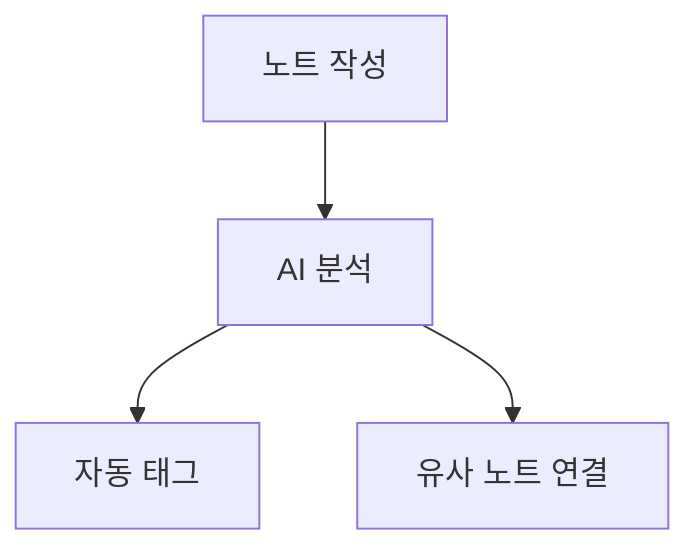

# BrainX — 노트 작성 페이지 기능 명세

> **범위**: 노트 작성 화면(`/notes/:id`)에서 사용자가 직접 보고 쓰는 기능만 정리  
> **제외**: 지식 그래프, 데일리 노트, 검색 페이지, 설정 등 별도 페이지 기능  
> **기준**: TipTap v3 · 데모 화면 분석 · Notion + Obsidian 교차 검토

---

## 목차

1. [페이지 레이아웃 구조](#1-페이지-레이아웃-구조)
2. [상단 액션바](#2-상단-액션바)
3. [노트 제목 & 메타정보](#3-노트-제목--메타정보)
4. [고정 툴바](#4-고정-툴바)
5. [버블 툴바 (Floating Toolbar)](#5-버블-툴바-floating-toolbar)
6. [슬래시 커맨드 (/)](#6-슬래시-커맨드-)
7. [텍스트 서식](#7-텍스트-서식)
8. [폰트 & 타이포그래피](#8-폰트--타이포그래피)
9. [글씨 색상 & 형광펜](#9-글씨-색상--형광펜)
10. [제목 & 문단 구조](#10-제목--문단-구조)
11. [목록](#11-목록)
12. [접기 / 펼치기 (Folding)](#12-접기--펼치기-folding)
13. [들여쓰기 가이드라인 (Indent Guide)](#13-들여쓰기-가이드라인-indent-guide)
14. [링크 & 참조](#14-링크--참조)
15. [코드 블록 & 코드 하이라이팅](#15-코드-블록--코드-하이라이팅)
16. [테이블](#16-테이블)
17. [이미지 & 파일 첨부](#17-이미지--파일-첨부)
18. [임베드 & 다이어그램](#18-임베드--다이어그램)
19. [에디터 모드 전환](#19-에디터-모드-전환)
20. [화면 분할 (Split View)](#20-화면-분할-split-view)
21. [우측 사이드바 패널](#21-우측-사이드바-패널)
22. [자동저장 & 버전 히스토리](#22-자동저장--버전-히스토리)
23. [단축키 전체 목록](#23-단축키-전체-목록)
24. [TipTap 패키지 목록](#24-tiptap-패키지-목록)
25. [MVP 우선순위 표](#25-mvp-우선순위-표)

---

## 1. 페이지 레이아웃 구조

```
┌─────────────────────────────────────────────────────────────────┐
│                        상단 액션바                               │
│  ✓저장됨  업로드  PDF  TXT  MD  🔗공유링크  ···더보기  🗑삭제   │
├──────────────────────────────────────┬──────────────────────────┤
│                                      │                          │
│             에디터 영역              │    우측 사이드바          │
│                                      │                          │
│  제목 입력                           │  ┌──────────────────┐   │
│  ─────────────────────               │  │ 목차 (TOC)       │   │
│  태그  ·  방금 수정  ·  80단어       │  ├──────────────────┤   │
│                                      │  │ 연결 · 백링크    │   │
│  ┌─ 고정 툴바 ──────────────────┐   │  ├──────────────────┤   │
│  │B / H1 H2 H3 • 1. — ... │   │  │ AI 연결 제안     │   │
│  └──────────────────────────────┘   │  ├──────────────────┤   │
│                                      │  │ 인라인 AI 채팅   │   │
│  내용을 입력하세요...                │  └──────────────────┘   │
│                                      │                          │
├──────────────────────────────────────┴──────────────────────────┤
│              상태바: 단어수 · 글자수 · 읽기시간                  │
└─────────────────────────────────────────────────────────────────┘
```

---

## 2. 상단 액션바

> 데모 확인: `✓ 저장됨 | 업로드 | PDF | TXT | MD | 🔗 공유 링크 | 🗑`

| 버튼 | 기능 | 비고 |
|------|------|------|
| ✓ 저장됨 | 자동저장 상태 표시 | 저장중 스피너 / 저장됨 체크 / 실패 경고 |
| 업로드 | 파일 첨부 다이얼로그 | 이미지·PDF·기타 |
| PDF | 현재 노트 PDF 내보내기 | |
| TXT | 텍스트 파일 내보내기 | |
| MD | Markdown 파일 내보내기 | |
| 🔗 공유 링크 | 공개 링크 생성 / 관리 | 읽기 전용 URL |
| ··· 더보기 | 추가 메뉴 드롭다운 | 아래 참고 |
| 🗑 삭제 | 노트 삭제 (휴지통 이동) | 30일 보관 후 자동 삭제 |

**··· 더보기 드롭다운**

```
├── 복제 (Duplicate)
├── 이동 (폴더 선택)
├── 즐겨찾기 토글 ⭐
├── 버전 히스토리
├── 단어 수 / 읽기 시간 표시
└── 노트 속성 (Properties) 열기
```

---

## 3. 노트 제목 & 메타정보

```
[ 제목 입력 ]                            ← 큰 글씨, 플레이스홀더 "제목 없음"
─────────────────────────────────────
● 머신러닝  +태그  ·  방금 수정  ·  80 단어
```

| 항목 | 설명 |
|------|------|
| 제목 | 큰 입력 필드, Enter → 에디터 본문으로 포커스 이동 |
| 태그 | 인라인 태그 목록, `+` 버튼으로 추가, 클릭으로 제거 |
| 수정 시간 | 상대시간 ("방금", "3분 전"), hover 시 전체 날짜 |
| 단어 수 | 실시간 카운터 (CharacterCount 확장) |
| 글자 수 | 단어 수 옆 또는 하단 상태바 |
| 읽기 시간 | 단어 수 ÷ 200 = 분 (선택 표시) |

---

## 4. 고정 툴바

에디터 상단에 항상 표시. 스크롤해도 고정(sticky).

### 4-1. 툴바 버튼 전체 구성

```
[서식 그룹]   B  I  U  S  `코드`
[헤딩 그룹]   H1  H2  H3
[목록 그룹]   •  1.  ☑
[삽입 그룹]   🔗  A색상  형광펜  인용구  콜아웃  —  테이블  이미지
[폰트 그룹]   작게 | 보통▼ | 크게 | 매우 크게   폰트패밀리▼
[정렬 그룹]   ≡좌  ≡중  ≡우  ≡양쪽
[모드 그룹]   편집  미리보기   [ | ]분할  Zen
[저장 상태]   ✓ 저장됨
```

### 4-2. 버튼별 상세

| 버튼 | 단축키 | 기능 |
|------|--------|------|
| **B** | Ctrl+B | Bold |
| *I* | Ctrl+I | Italic |
| <u>U</u> | Ctrl+U | Underline |
| ~~S~~ | Ctrl+Shift+X | Strikethrough |
| `` ` `` | Ctrl+E | Inline Code |
| H1~H3 | Ctrl+Alt+1~3 | 헤딩 |
| • | Ctrl+Shift+8 | 불릿 목록 |
| 1. | Ctrl+Shift+7 | 순서 목록 |
| ☑ | Ctrl+Shift+9 | 체크박스 목록 |
| 🔗 | Ctrl+K | 하이퍼링크 삽입 |
| A색상 | Ctrl+Shift+C | 글씨 색상 피커 |
| 형광펜 | Ctrl+Shift+H | 형광펜 색상 피커 |
| 인용구 | Ctrl+Shift+B | Blockquote |
| — | — | 구분선 |
| 테이블 | — | 테이블 삽입 |
| 이미지 | — | 이미지 업로드 |

---

## 5. 버블 툴바 (Floating Toolbar)

텍스트를 드래그해서 선택하면 선택 영역 위에 자동으로 뜨는 미니 툴바.

```
선택한 텍스트 위에 팝업
┌──────────────────────────────────────────┐
│  B  I  U  S  `  🔗  A▼  🖍▼  ✨AI  ···  │
└──────────────────────────────────────────┘
```

| 버튼 | 기능 |
|------|------|
| B I U S | 기본 서식 |
| `` ` `` | 인라인 코드 |
| 🔗 | 링크 삽입 |
| A▼ | 글씨 색상 드롭다운 |
| 🖍▼ | 형광펜 드롭다운 |
| ✨ AI | AI 액션 드롭다운 (요약/번역/다시쓰기 등) |
| ··· | 추가 서식 (위첨자/아래첨자 등) |

---

## 6. 슬래시 커맨드 (/)

에디터 빈 줄에서 `/` 입력 시 팝업 메뉴 표시.  
계속 타이핑하면 필터링됨 (예: `/cod` → 코드블록 바로 노출).

### 6-1. 기본 블록

| 커맨드 | 삽입 결과 |
|--------|-----------|
| `/h1` ~ `/h6` | 헤딩 H1~H6 |
| `/text` | 기본 단락 |
| `/bullet` `/ul` | 불릿 목록 |
| `/numbered` `/ol` | 순서 목록 |
| `/todo` `/check` | 체크박스 목록 |
| `/quote` | 인용구 |
| `/callout` | 콜아웃 박스 (종류 선택) |
| `/divider` `/hr` | 구분선 |

### 6-2. 미디어 & 데이터

| 커맨드 | 삽입 결과 |
|--------|-----------|
| `/image` | 이미지 업로드 다이얼로그 |
| `/file` | 파일 첨부 |
| `/table` | 테이블 (행/열 수 선택 UI) |
| `/code` | 코드 블록 (언어 선택) |
| `/math` | 수식 블록 (KaTeX) |
| `/mermaid` | Mermaid 다이어그램 |
| `/embed` `/youtube` | URL 임베드 |

### 6-3. 참조 & 날짜

| 커맨드 | 삽입 결과 |
|--------|-----------|
| `/link` `[[` | 위키링크 자동완성 |
| `/tag` | 태그 삽입 |
| `/toc` | 목차 (TOC) 자동 생성 |
| `/date` | 오늘 날짜 삽입 |

### 6-4. AI 명령 (3주차)

| 커맨드 | 동작 |
|--------|------|
| `/요약` | 현재 노트 AI 요약 생성 |
| `/번역` | 선택 텍스트 번역 |
| `/이어쓰기` `/continue` | 커서 위치에서 AI 자동완성 |
| `/체크리스트` | 내용 기반 할 일 목록 생성 |
| `/설명추가` | 선택 텍스트 설명 확장 |
| `/태그추천` | AI 태그 추천 |

---

## 7. 텍스트 서식

### 7-1. 인라인 서식

| 기능 | 단축키 | TipTap 패키지 |
|------|--------|----------------|
| **Bold** | Ctrl+B | StarterKit 내장 |
| *Italic* | Ctrl+I | StarterKit 내장 |
| <u>Underline</u> | Ctrl+U | `@tiptap/extension-underline` |
| ~~Strikethrough~~ | Ctrl+Shift+X | StarterKit 내장 |
| `Inline Code` | Ctrl+E | StarterKit 내장 |
| X² 위첨자 | — | `@tiptap/extension-superscript` |
| X₂ 아래첨자 | — | `@tiptap/extension-subscript` |

### 7-2. 텍스트 정렬

| 정렬 | 단축키 |
|------|--------|
| 왼쪽 | Ctrl+Shift+L |
| 가운데 | Ctrl+Shift+E |
| 오른쪽 | Ctrl+Shift+R |
| 양쪽 | Ctrl+Shift+J |

패키지: `@tiptap/extension-text-align`

---

## 8. 폰트 & 타이포그래피

### 8-1. 폰트 크기

**프리셋 버튼 (툴바)**

| 버튼 | 크기 |
|------|------|
| 작게 | 12px |
| 보통 (기본) | 16px |
| 크게 | 20px |
| 매우 크게 | 24px |

**드롭다운 세부 조절**

```
12 / 14 / 16 / 18 / 20 / 24 / 28 / 32 / 36 / 48px
```

- 선택한 텍스트에만 적용 (인라인)
- 에디터 기본 크기는 설정 메뉴에서 변경

패키지: `@tiptap/extension-font-size`

### 8-2. 폰트 패밀리

```
Pretendard        (기본 — 한글 최적화)
Noto Sans KR
D2Coding          (코드용 모노스페이스)
Times New Roman   (Serif)
```

패키지: `@tiptap/extension-font-family`

### 8-3. 줄간격

```
1.0 / 1.25 / 1.5(기본) / 1.75 / 2.0
```

---

## 9. 글씨 색상 & 형광펜

### 9-1. 글씨 색상

```
기본 팔레트 16색
┌────────────────────────────────────────┐
│  ⚫ ⬛ 🔘 ⬜  빨강 주황 노랑          │
│  초록 하늘 파랑 남색 보라 분홍        │
│  [커스텀 hex 입력]  [초기화]           │
└────────────────────────────────────────┘
```

- 최근 사용 색상 5개 상단 노출
- 패키지: `@tiptap/extension-color` + `@tiptap/extension-text-style`

### 9-2. 형광펜 (Highlight)

```
형광 팔레트 8색
┌────────────────────────────────────────┐
│  🟡노랑  🟢초록  🔵파랑  🟣보라      │
│  🩷분홍  🟠주황  ⬜회색  🔴빨강      │
└────────────────────────────────────────┘
```

- 기본: 노랑 형광 (#FEF08A)
- 단축키: Ctrl+Shift+H
- 다크모드에서 채도 자동 조정
- 패키지: `@tiptap/extension-highlight` (`multicolor: true`)

---

## 10. 제목 & 문단 구조

### 10-1. 헤딩 (H1~H6)

```
단축키: Ctrl+Alt+1 ~ 6
마크다운: # 제목 (입력 후 Space)
```

- 헤딩 클릭 시 좌측 앵커 링크(🔗) 표시
- 헤딩 좌측 ▶/▼ 화살표: 접기/펼치기 (섹션 12 참고)
- H1~H3 → 우측 사이드바 TOC에 자동 반영

### 10-2. 인용구 (Blockquote)

```
단축키: Ctrl+Shift+B
마크다운: > 텍스트
중첩: 최대 3단계
```

### 10-3. 콜아웃 박스

```
📘 Info     (파란 배경)
⚠️ Warning  (노란 배경)
❌ Error    (빨간 배경)
✅ Success  (초록 배경)
📝 Note     (회색 배경)
💡 Tip      (연두 배경)
```

- 아이콘: 이모지 변경 가능
- 구조: 아이콘 + 제목 + 본문
- 커스텀 TipTap 확장 필요

### 10-4. 구분선

```
마크다운: --- (Enter)
툴바: — 버튼
```

---

## 11. 목록

### 11-1. 불릿 목록

```
단축키: Ctrl+Shift+8
마크다운: - 텍스트 (Space)
들여쓰기: Tab  /  내어쓰기: Shift+Tab
최대 6단계 중첩
```

### 11-2. 순서 목록

```
단축키: Ctrl+Shift+7
마크다운: 1. 텍스트 (Space)
시작 번호 지정 가능
스타일: 숫자 / 알파벳 / 로마자
```

### 11-3. 체크박스 목록 (Task List)

```
단축키: Ctrl+Shift+9
마크다운: - [ ] 텍스트  /  - [x] 완료
```

- 체크박스 클릭 → 완료/미완료 토글
- 완료 항목: 취소선 자동 적용
- 완료율 진행 바 (선택 표시)
- 패키지: `@tiptap/extension-task-list` + `@tiptap/extension-task-item`

---

## 12. 접기 / 펼치기 (Folding)

> Obsidian의 핵심 기능.  
> 헤딩 또는 목록 항목 옆 화살표(▶/▼)로 하위 내용 전체를 숨기거나 표시.

### 12-1. 헤딩 Folding

```
펼친 상태:
## 2. 핵심 개념  ▼
  ### 2-1. 세부 내용  ▼
    내용 텍스트...

접힌 상태:
## 2. 핵심 개념  ▶   ← 하위 전체 숨김
```

**동작**

| 액션 | 방법 |
|------|------|
| 현재 헤딩 접기 | 화살표 클릭 또는 Ctrl+Shift+[ |
| 현재 헤딩 펼치기 | 화살표 클릭 또는 Ctrl+Shift+] |
| 전체 접기 | Ctrl+Shift+, |
| 전체 펼치기 | Ctrl+Shift+. |

**범위 규칙**

```
H2 접기 → 그 H2 아래 H3, H4, 본문 모두 숨김
H3 접기 → 그 H3 아래만 숨김 (부모 H2는 유지)
중첩 상태 독립 유지 (H2 펼쳐도 내부 H3 접힘 상태 유지)
```

**상태 저장**: 노트 이동 후 돌아와도 접힘 상태 복원 (localStorage)

### 12-2. 목록 Folding

```
펼친 상태:
- 부모 항목  ▼
  - 자식 항목 A
  - 자식 항목 B

접힌 상태:
- 부모 항목  ▶   ← 자식 항목 숨김
```

- 자식이 없는 항목은 화살표 미표시
- 불릿 / 순서 / 체크박스 목록 모두 적용

### 12-3. 구현 방식

```typescript
// Heading에 folded attribute 추가하는 커스텀 확장
const FoldableHeading = Heading.extend({
  addAttributes() {
    return {
      ...this.parent?.(),
      folded: {
        default: false,
        parseHTML: el => el.getAttribute('data-folded') === 'true',
        renderHTML: attrs => ({ 'data-folded': attrs.folded }),
      },
    }
  },
  // NodeView에서 ▶/▼ 화살표 렌더링 + 클릭 핸들러
})
```

> MVP 팁: **헤딩 Folding 먼저** 구현하고, 목록 Folding은 이후 추가.

---

## 13. 들여쓰기 가이드라인 (Indent Guide)

> VS Code / Obsidian의 인덴트 세로줄과 동일한 개념.  
> 중첩 목록의 depth를 세로선으로 시각화해 계층 구조를 한눈에 파악.

### 13-1. 시각적 표현

```
•  1단계 항목
   │  •  2단계 항목       ← 세로 가이드라인 1개
   │     •  3단계 항목    ← 세로 가이드라인 2개
   │        •  4단계      ← 세로 가이드라인 3개
   │     •  3단계 다른 항목
   │  •  2단계 다른 항목
•  1단계 다른 항목
```

### 13-2. 디자인 스펙

| 항목 | 값 |
|------|-----|
| 라이트 모드 색상 | `rgba(0, 0, 0, 0.12)` 회색 실선 |
| 다크 모드 색상 | `rgba(255, 255, 255, 0.12)` 흰색 실선 |
| hover 강조 | `rgba(주색상, 0.4)` |
| 선 굵기 | 1px |
| 선 스타일 | 실선 (설정에서 점선 변경 가능) |
| 들여쓰기 간격 | 24px (기본), 16/20/24/28px 선택 |

### 13-3. 적용 범위

```
적용 O  — 불릿 목록 중첩 / 순서 목록 중첩 / 체크박스 목록 중첩
적용 X  — 코드 블록 내부 / 테이블 셀 내부
```

### 13-4. CSS 구현 (권장)

```css
/* 중첩 목록에 세로 가이드라인 */
.tiptap ul ul,
.tiptap ol ol,
.tiptap ul ol,
.tiptap ol ul {
  border-left: 1px solid rgba(0, 0, 0, 0.12);
  padding-left: 24px;
}

/* 다크 모드 */
.dark .tiptap ul ul,
.dark .tiptap ol ol {
  border-left-color: rgba(255, 255, 255, 0.12);
}

/* hover 시 해당 depth 강조 */
.tiptap li:hover > ul,
.tiptap li:hover > ol {
  border-left-color: rgba(99, 102, 241, 0.5);
}
```

> MVP 팁: CSS만으로 완전히 구현 가능. 1주차에 바로 적용 권장.

---

## 14. 링크 & 참조

### 14-1. 하이퍼링크

```
단축키: Ctrl+K
방법: 텍스트 선택 → Ctrl+K → URL 입력 팝업
```

**팝업 입력 항목**

```
URL        (필수)
표시 텍스트 (선택, 미입력 시 URL 표시)
새 탭에서 열기 ☑
```

- 링크 위 hover → 미리보기 툴팁 (URL + 편집/삭제 버튼)
- URL 붙여넣기 시 "링크 카드로 변환?" 선택 (OG 카드)
- autolink: URL 텍스트 입력 시 자동 링크 변환

패키지: `@tiptap/extension-link`

### 14-2. 위키링크 (Wiki Link)

```
[[노트 제목]]              기본 링크
[[노트 제목|표시 이름]]    별칭 링크
[[노트 제목#헤딩]]         특정 섹션 링크
```

**자동완성 UX**

```
[[ 입력
  ↓
드롭다운: 최근 노트 + 퍼지 검색
  ↓
선택 → [[노트 제목]] 완성
```

- 존재하는 노트 → 파란색, 클릭 시 이동
- 없는 노트 → 주황 점선, 클릭 시 "새 노트 생성" 확인
- 커스텀 TipTap 확장 필요

### 14-3. 태그 인라인 입력

```
#태그이름
#계층/태그
```

- `#` 입력 시 기존 태그 자동완성 드롭다운
- 패키지: `@tiptap/extension-mention` 활용

### 14-4. 멘션 (@Mention)

```
@사용자명  → 워크스페이스 팀원 태그
```

패키지: `@tiptap/extension-mention`

### 14-5. 각주 (Footnote)

```
본문 텍스트[^1]

[^1]: 각주 내용
```

- 번호 자동 부여
- 클릭 시 페이지 하단 각주로 스크롤

---

## 15. 코드 블록 & 코드 하이라이팅

### 15-1. 코드 블록 UI

```
┌─ javascript ──────────────────────── [복사] ─┐
│  1  const hello = () => {                   │
│  2    console.log("Hello, BrainX!");        │
│  3  }                                       │
└─────────────────────────────────────────────┘
```

| 요소 | 설명 |
|------|------|
| 언어 배지 (좌상단) | 클릭 → 언어 변경 드롭다운 |
| 줄 번호 | 표시/숨김 토글 |
| 복사 버튼 (우상단) | 클릭 시 "복사됨!" 피드백 |
| 테마 | 에디터 다크/라이트 연동 |

### 15-2. 지원 언어 (주요)

```
웹     — JavaScript, TypeScript, HTML, CSS, JSON
백엔드 — Java, Python, Go, Kotlin, SQL
인프라 — Bash, Dockerfile, YAML, Terraform
기타   — Markdown, 총 50개 이상
```

### 15-3. 인라인 코드

```
`코드` — 단축키 Ctrl+E, 또는 백틱 1개로 감싸기
```

### 15-4. 패키지

```typescript
import CodeBlockLowlight from '@tiptap/extension-code-block-lowlight'
import { lowlight } from 'lowlight'

CodeBlockLowlight.configure({
  lowlight,
  defaultLanguage: 'plaintext',
})
// ※ StarterKit의 기본 CodeBlock을 교체해서 사용
```

---

## 16. 테이블

### 16-1. 삽입

```
슬래시 커맨드: /table → 행/열 수 그리드 선택 (최소 2×2, 최대 20×20)
툴바: 테이블 버튼 클릭
```

### 16-2. 조작

| 기능 | 방법 |
|------|------|
| 행/열 추가 | 우클릭 메뉴 또는 셀 끝 + 버튼 |
| 행/열 삭제 | 우클릭 메뉴 |
| 셀 병합 | 여러 셀 선택 → 병합 |
| 셀 분리 | 병합된 셀 → 분리 |
| 헤더 행 | 첫 행을 헤더로 지정 토글 |
| 열 너비 | 경계선 드래그 |
| 열 정렬 | 좌 / 가운데 / 우 |

- 셀 내부에서 Bold / Italic / 링크 / 인라인 코드 모두 사용 가능

패키지: `@tiptap/extension-table` + `table-row` + `table-header` + `table-cell`

---

## 17. 이미지 & 파일 첨부

### 17-1. 이미지 삽입 방법

| 방법 | 설명 |
|------|------|
| 파일 업로드 | 파일 선택 다이얼로그 |
| 드래그 앤 드롭 | 에디터 영역에 직접 |
| 클립보드 붙여넣기 | Ctrl+V |
| URL 입력 | 외부 이미지 URL |

### 17-2. 이미지 편집 옵션

```
크기 조절    — 모서리 핸들 드래그 (비율 유지 토글)
정렬         — 왼쪽 / 가운데 / 오른쪽 / 전체 너비
캡션         — 이미지 하단 텍스트 입력
Alt 텍스트   — 접근성용 설명
링크 연결    — 이미지 클릭 시 URL 이동
```

### 17-3. 파일 첨부

```
지원 형식 — PDF, Word, Excel, PPT, ZIP 등
표시 방식 — 파일 카드 (아이콘 + 파일명 + 크기)
PDF       — 인라인 미리보기 지원
다운로드  — 카드 우측 다운로드 버튼
```

---

## 18. 임베드 & 다이어그램

### 18-1. 링크 카드 (URL Unfurl)

```
URL 붙여넣기 → "링크 카드로 변환?" 팝업
├── 카드: 파비콘 + 제목 + 설명 + 대표 이미지
└── 일반 링크 유지 선택 가능
```

### 18-2. 외부 서비스 임베드

| 서비스 | 방법 |
|--------|------|
| YouTube / Vimeo | URL 붙여넣기 → 인라인 플레이어 |
| Twitter / X | URL 붙여넣기 → 트윗 카드 |
| GitHub Gist | URL 붙여넣기 → 코드 임베드 |

### 18-3. Mermaid 다이어그램

````markdown

````

- 코드 작성 → 우측 실시간 미리보기
- 지원: Flowchart / Sequence / Gantt / ER / Class / State / Pie

### 18-4. 수식 (KaTeX)

```
인라인:  $E = mc^2$
블록:    $$\sum_{i=1}^{n} x_i$$
```

- 실시간 렌더링

---

## 19. 에디터 모드 전환

툴바 우측에서 모드 전환 버튼 표시.

| 모드 | 설명 |
|------|------|
| **편집 모드** (기본) | TipTap WYSIWYG, 마크다운 단축키 지원 |
| **미리보기 모드** | 편집 불가, 렌더링된 읽기 전용 뷰 |
| **소스 모드** | 순수 Markdown 텍스트 편집 (CodeMirror) |
| **Zen 모드** | 전체화면 + 사이드바 숨김, 에디터만 집중 표시 |

**Zen 모드 상세**

```
단축키: F11 또는 Ctrl+Shift+Z
에디터 최대 너비 800px, 중앙 정렬
ESC 또는 동일 단축키로 복귀
```

---

## 20. 화면 분할 (Split View)

### 20-1. 분할 종류

**편집 + 미리보기 분할** (가장 많이 사용)

```
┌─────────────────────┬─────────────────────┐
│   Markdown 편집기   │   렌더링 미리보기   │
│   (TipTap)          │   (읽기 전용)        │
└─────────────────────┴─────────────────────┘
     스크롤 위치 실시간 동기화
```

**노트 + 노트 분할** (Obsidian 스타일)

```
┌─────────────────────┬─────────────────────┐
│      노트 A         │      노트 B         │
│   (독립 편집)       │   (독립 편집)        │
└─────────────────────┴─────────────────────┘
```

**상하 분할**

```
┌─────────────────────────────────────────────┐
│                   노트 A                    │
├─────────────────────────────────────────────┤
│                   노트 B                    │
└─────────────────────────────────────────────┘
```

**4분할 (최대)**

```
┌──────────────┬──────────────┐
│      A       │      B       │
├──────────────┼──────────────┤
│      C       │      D       │
└──────────────┴──────────────┘
```

### 20-2. 패널 동작

| 기능 | 방법 |
|------|------|
| 비율 조절 | 구분선 드래그 (min 20% / max 80%) |
| 패널 닫기 | 우상단 X 버튼 또는 Ctrl+W |
| 패널 최대화 | 우상단 □ 버튼 (임시) |
| 노트 이동 | 탭을 다른 패널로 드래그 |

### 20-3. 단축키

| 단축키 | 기능 |
|--------|------|
| Ctrl+\ | 좌우 분할 |
| Ctrl+Shift+\ | 상하 분할 |
| Ctrl+W | 현재 패널 닫기 |
| Ctrl+Shift+F | 현재 패널 최대화 토글 |

---

## 21. 우측 사이드바 패널

노트 작성 화면 우측에 고정된 컨텍스트 패널 4종.  
각 패널은 아이콘 탭으로 토글 가능.

### 21-1. 목차 (Table of Contents)

```
현재 노트의 H1~H3 자동 추출
├── 계층 들여쓰기로 구조 표시
├── 현재 스크롤 위치 항목 하이라이트
└── 클릭 → 해당 섹션으로 스크롤
```

### 21-2. 연결 · 백링크

```
[연결] 탭
├── Outgoing: 이 노트에서 링크하는 노트 목록
└── Incoming: 이 노트를 링크하는 노트 목록 (백링크)

[미연결 언급] 탭
├── [[링크]] 없이 제목만 언급된 노트
└── "링크로 변환" 원클릭 버튼
```

### 21-3. AI 연결 제안 (3주차)

```
저장 시 백그라운드 임베딩 분석
├── 유사도 높은 노트 Top 3~5 추천
├── 유사도 % 표시
├── 관련 문맥 미리보기 (30자)
└── "연결 추가" → [[위키링크]] 자동 삽입
```

### 21-4. 인라인 AI 채팅 (3주차)

```
"이 노트에 대해 무엇이든 물어보세요."
├── 현재 노트 컨텍스트 기반 Q&A
├── RAG 연동 (관련 노트 함께 검색)
├── 출처 노트 인용 표시
└── 세션 동안 대화 히스토리 유지
```

---

## 22. 자동저장 & 버전 히스토리

### 22-1. 자동저장

| 트리거 | 설명 |
|--------|------|
| 타이핑 중단 500ms | Debounce 자동 저장 |
| 에디터 포커스 이탈 | blur 이벤트 저장 |
| 브라우저 탭 변경/닫기 | beforeunload 저장 |
| Ctrl+S | 수동 즉시 저장 |

**상태 표시**

```
저장 중  →  🔄 저장 중...
저장됨   →  ✓  저장됨
실패     →  ⚠  저장 실패 — 재시도 버튼
```

### 22-2. 버전 히스토리

```
최대 100개 버전 보관
├── 버전 목록: 날짜 + 시간 + 변경 크기
├── 클릭 → 해당 시점 내용 미리보기
├── diff 뷰: 추가(초록) / 삭제(빨강)
└── "이 버전으로 복원" 버튼
```

### 22-3. 휴지통

```
삭제 → 휴지통 이동 (즉시 삭제 아님)
30일 후 자동 영구 삭제
복원: 원래 위치 또는 위치 선택 후 복원
영구 삭제: 명시적 확인 필요
```

---

## 23. 단축키 전체 목록

### 서식

| 단축키 | 기능 |
|--------|------|
| Ctrl+B | Bold |
| Ctrl+I | Italic |
| Ctrl+U | Underline |
| Ctrl+Shift+X | Strikethrough |
| Ctrl+E | Inline Code |
| Ctrl+K | 하이퍼링크 삽입 |
| Ctrl+Shift+H | 형광펜 토글 |
| Ctrl+Shift+C | 글씨 색상 피커 |

### 구조 & 목록

| 단축키 | 기능 |
|--------|------|
| Ctrl+Alt+1~6 | 헤딩 H1~H6 |
| Ctrl+Shift+8 | 불릿 목록 |
| Ctrl+Shift+7 | 순서 목록 |
| Ctrl+Shift+9 | 체크박스 목록 |
| Ctrl+Shift+B | 인용구 |
| Tab | 들여쓰기 |
| Shift+Tab | 내어쓰기 |

### Folding

| 단축키 | 기능 |
|--------|------|
| Ctrl+Shift+[ | 현재 헤딩 접기 |
| Ctrl+Shift+] | 현재 헤딩 펼치기 |
| Ctrl+Shift+, | 모두 접기 |
| Ctrl+Shift+. | 모두 펼치기 |

### 에디터 & 화면

| 단축키 | 기능 |
|--------|------|
| Ctrl+S | 수동 저장 |
| Ctrl+Z | 실행 취소 |
| Ctrl+Shift+Z | 다시 실행 |
| Ctrl+F | 노트 내 검색 |
| Ctrl+H | 찾기 & 바꾸기 |
| Ctrl+\ | 좌우 화면 분할 |
| Ctrl+Shift+\ | 상하 화면 분할 |
| Ctrl+W | 현재 패널 닫기 |
| F11 / Ctrl+Shift+Z | Zen Mode 토글 |

### 마크다운 자동 변환

| 입력 | 결과 |
|------|------|
| `# ` + Space | H1 |
| `## ` + Space | H2 |
| `- ` + Space | 불릿 목록 |
| `1. ` + Space | 순서 목록 |
| `[ ] ` + Space | 체크박스 |
| `> ` + Space | 인용구 |
| ` ``` ` + Enter | 코드 블록 |
| `---` + Enter | 구분선 |
| `[[` | 위키링크 자동완성 |
| `**텍스트**` | Bold |
| `*텍스트*` | Italic |

---

## 24. TipTap 패키지 목록

```typescript
// ── 1주차 필수 ───────────────────────────────────────
import StarterKit from '@tiptap/starter-kit'
// Bold, Italic, Strike, Code, Heading, BulletList,
// OrderedList, Blockquote, HorizontalRule, History 포함

import Underline from '@tiptap/extension-underline'
import Superscript from '@tiptap/extension-superscript'
import Subscript from '@tiptap/extension-subscript'
import TextStyle from '@tiptap/extension-text-style'   // Color 의존성
import Color from '@tiptap/extension-color'
import Highlight from '@tiptap/extension-highlight'    // multicolor: true
import FontSize from '@tiptap/extension-font-size'
import FontFamily from '@tiptap/extension-font-family'
import TextAlign from '@tiptap/extension-text-align'
import Link from '@tiptap/extension-link'
import TaskList from '@tiptap/extension-task-list'
import TaskItem from '@tiptap/extension-task-item'
import Placeholder from '@tiptap/extension-placeholder'
import CharacterCount from '@tiptap/extension-character-count'
import Typography from '@tiptap/extension-typography'

// CodeBlock 교체 (StarterKit 기본 CodeBlock 비활성화 필요)
import CodeBlockLowlight from '@tiptap/extension-code-block-lowlight'
import { lowlight } from 'lowlight'

// ── 2주차 ────────────────────────────────────────────
import Image from '@tiptap/extension-image'
import Table from '@tiptap/extension-table'
import TableRow from '@tiptap/extension-table-row'
import TableHeader from '@tiptap/extension-table-header'
import TableCell from '@tiptap/extension-table-cell'
import Mention from '@tiptap/extension-mention'        // 위키링크 기반

// ── 커스텀 확장 (직접 구현) ──────────────────────────
// WikiLink          — [[ ]] 위키링크 + 자동완성
// Callout           — 콜아웃 박스 (Info/Warning/Error 등)
// SlashCommand      — / 슬래시 커맨드 팝업
// FontSizePreset    — 작게/보통/크게/매우크게 버튼
// FoldableHeading   — 헤딩 접기/펼치기 (▶/▼)
// FoldableList      — 목록 접기/펼치기
// IndentGuide       — CSS로 구현 (별도 확장 불필요)
```

---

## 25. MVP 우선순위 표

### 1주차 — 에디터 기반 (반드시 완성)

| 기능 | 난이도 | 우선순위 |
|------|--------|----------|
| StarterKit (Bold/Italic/Heading/List 등) | 낮음 | ★★★ |
| Underline / Strike / Inline Code | 낮음 | ★★★ |
| 하이퍼링크 (Ctrl+K) | 낮음 | ★★★ |
| 글씨 색상 | 낮음 | ★★★ |
| 형광펜 (multicolor) | 낮음 | ★★★ |
| 폰트 크기 프리셋 4종 | 낮음 | ★★★ |
| 코드 블록 + 하이라이팅 (lowlight) | 중간 | ★★★ |
| 체크박스 목록 (Task List) | 낮음 | ★★★ |
| 들여쓰기 가이드라인 (CSS) | 낮음 | ★★★ |
| 자동저장 (debounce 500ms) | 낮음 | ★★★ |
| 마크다운 자동 변환 단축키 | 낮음 | ★★★ |
| 노트 제목 + 메타 정보 영역 | 낮음 | ★★★ |

### 2주차 — 핵심 UX

| 기능 | 난이도 | 우선순위 |
|------|--------|----------|
| 슬래시 커맨드 (/) | 중간 | ★★★ |
| 버블 툴바 (텍스트 선택 시) | 중간 | ★★★ |
| 테이블 | 중간 | ★★★ |
| 이미지 업로드 | 중간 | ★★★ |
| 헤딩 접기/펼치기 (Folding) | 중간 | ★★☆ |
| 콜아웃 박스 | 중간 | ★★☆ |
| 위키링크 [[]] | 높음 | ★★☆ |
| 백링크 사이드바 패널 | 높음 | ★★☆ |
| 목차 (TOC) 사이드바 패널 | 중간 | ★★☆ |
| 화면 분할 편집+미리보기 | 높음 | ★★☆ |
| 버전 히스토리 | 중간 | ★★☆ |

### 3주차 — Obsidian 고급 + AI

| 기능 | 난이도 | 우선순위 |
|------|--------|----------|
| AI 연결 제안 사이드바 | 높음 | ★★☆ |
| 인라인 AI 채팅 사이드바 | 높음 | ★★☆ |
| AI 슬래시 커맨드 | 높음 | ★★☆ |
| 버블 툴바 AI 액션 | 높음 | ★★☆ |
| 수식 (KaTeX) | 중간 | ★☆☆ |
| Mermaid 다이어그램 | 중간 | ★☆☆ |
| 목록 접기/펼치기 | 높음 | ★☆☆ |
| 화면 분할 노트+노트 | 높음 | ★☆☆ |

---

> **핵심 원칙**  
> AI 기능(3주차)이 꺼져 있어도 1~2주차 기능은 100% 동작해야 한다.  
> AI는 보조 기능. 노트 작성 · 저장 · 서식 · 링크는 AI 없이 완전히 동작.
