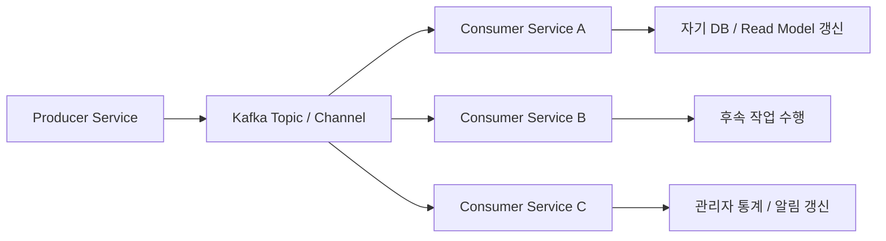
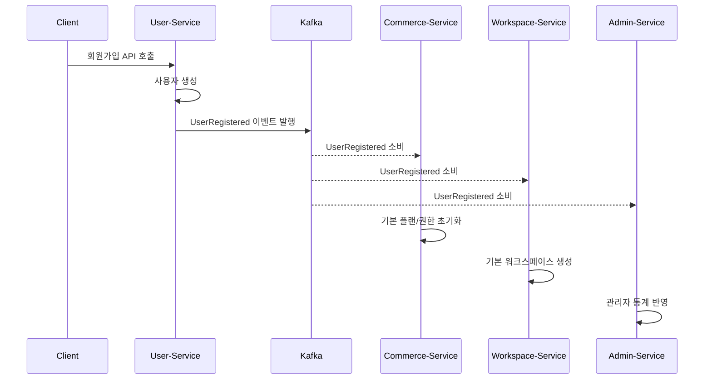
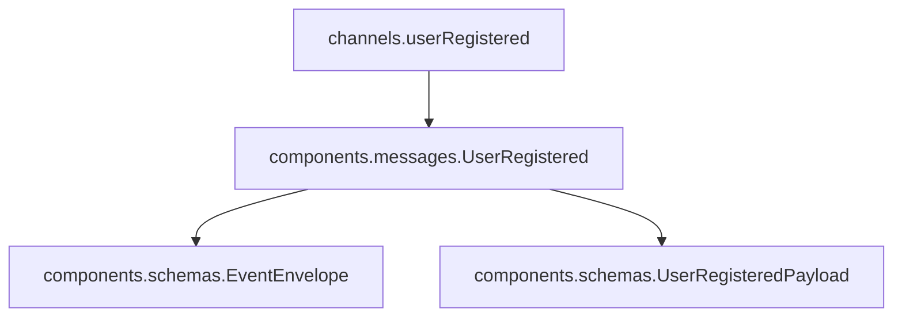
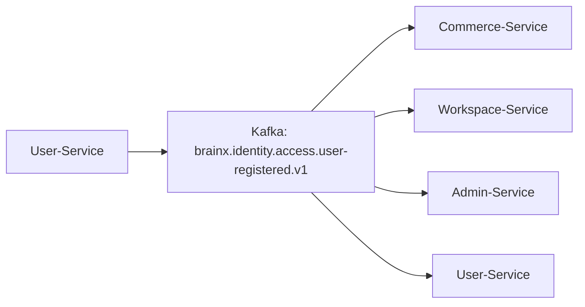
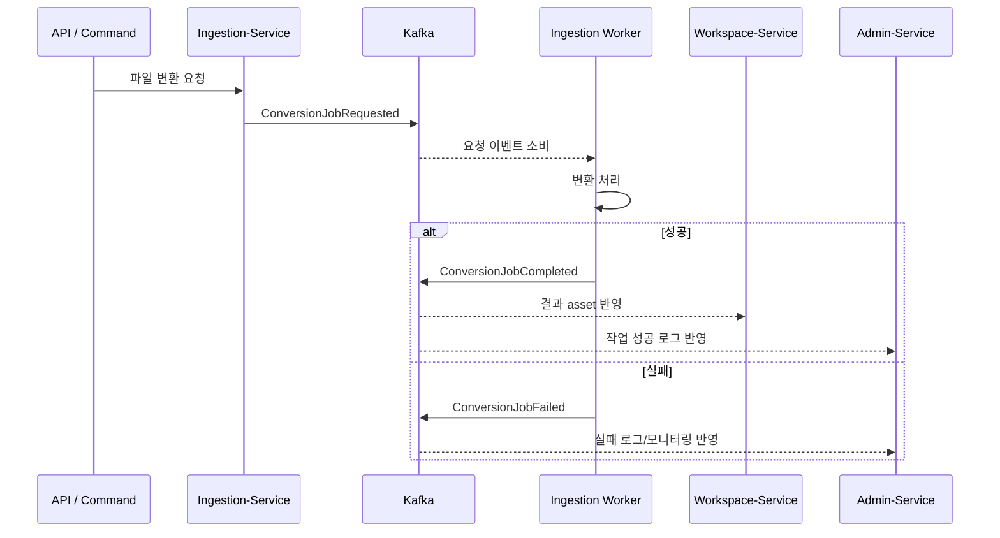
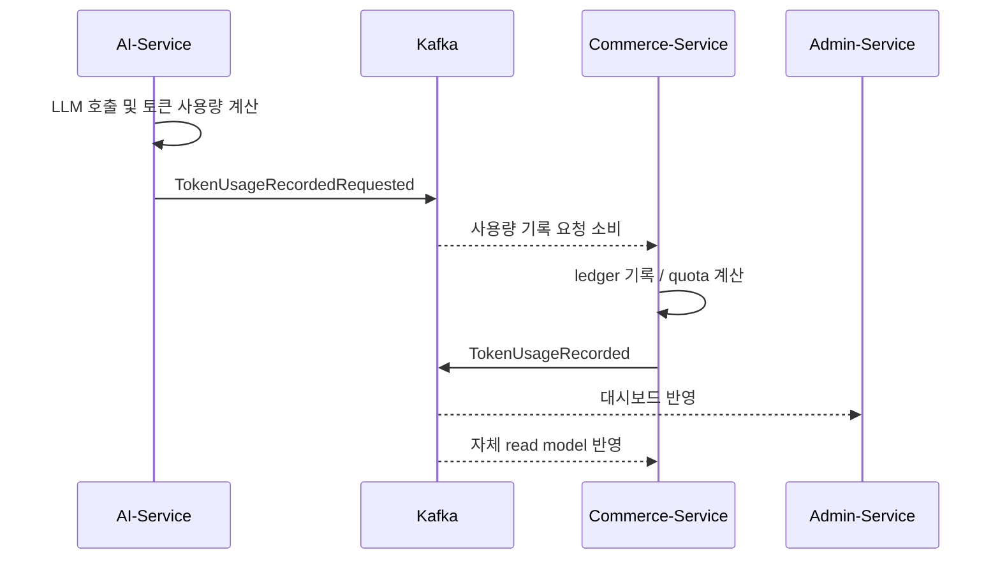

# BrainX AsyncAPI 한눈에 보기

대상 파일: `brainx-asyncapi.ssot.yaml`  
문서 목적: BrainX 서비스들이 Kafka를 통해 주고받는 비동기 이벤트 계약을 이해하기 쉽게 정리한다.

---

## 1. 이 문서는 무엇인가?

`brainx-asyncapi.ssot.yaml`은 BrainX의 **서비스 간 비동기 이벤트 통신 계약서**다.

REST/OpenAPI가 "요청을 보내고 바로 응답을 받는 API 계약"이라면, AsyncAPI는 "어떤 서비스가 어떤 이벤트를 Kafka에 발행하고, 어떤 서비스가 그 이벤트를 소비하는지"를 정의한다.

이 문서의 핵심은 다음과 같다.

| 구분 | 설명 |
|---|---|
| 통신 방식 | Kafka 기반 비동기 이벤트 |
| 메시지 형식 | JSON |
| 문서 역할 | 이벤트 이름, topic 주소, producer, consumer, payload 구조 정의 |
| 동기 API 위치 | `brainx-openapi.ssot.yaml`의 `/internal/v1` |
| 비동기 이벤트 위치 | `brainx-asyncapi.ssot.yaml` |

---

## 2. 전체 구조

원본 YAML의 큰 구조는 다음과 같다.

```yaml
asyncapi: 3.0.0
info:
servers:
defaultContentType:
channels:
operations:
components:
  messages:
  schemas:
  securitySchemes:
x-ssot:
x-service-catalog:
```

한 줄로 요약하면:

```text
servers = Kafka 위치
channels = Kafka topic
operations = 누가 어떤 이벤트를 보내는지
components.messages = 이벤트 메시지 껍데기
components.schemas = 공통 envelope와 payload 구조
x-ssot = BrainX 이벤트 운영 규칙
x-service-catalog = 서비스 목록
```

---

## 3. 통신 모델

BrainX의 이벤트 흐름은 기본적으로 다음 구조다.



예를 들어 사용자가 가입하면:



---

## 4. 주요 YAML 요소 설명

### 4.1 `asyncapi`

```yaml
asyncapi: 3.0.0
```

이 문서가 AsyncAPI 3.0.0 스펙을 따른다는 뜻이다.

---

### 4.2 `info`

```yaml
info:
  title: BrainX Async Event SSOT
  version: 1.0.0-revised
```

문서의 제목, 버전, 설명이다.  
여기서 SSOT는 **Single Source of Truth**, 즉 이벤트 계약의 기준 문서라는 뜻이다.

---

### 4.3 `servers`

```yaml
servers:
  localKafka:
    host: localhost:9092
    protocol: kafka
  prodBroker:
    host: broker.brainx.internal:9092
    protocol: kafka
```

Kafka broker 위치를 정의한다.

| 서버 | 의미 |
|---|---|
| `localKafka` | 로컬 개발용 Kafka |
| `prodBroker` | 운영 내부 Kafka broker |

---

### 4.4 `defaultContentType`

```yaml
defaultContentType: application/json
```

이벤트 메시지의 기본 형식이 JSON이라는 뜻이다.

---

### 4.5 `channels`

AsyncAPI에서 `channel`은 Kafka 기준으로 보면 거의 **topic**이다.

예시:

```yaml
userRegistered:
  address: brainx.identity.access.user-registered.v1
  messages:
    UserRegistered:
      $ref: '#/components/messages/UserRegistered'
  x-producer-service: User-Service
  x-consumer-services:
  - Commerce-Service
  - Workspace-Service
  - User-Service
  - Admin-Service
```

의미:

| 항목 | 의미 |
|---|---|
| `userRegistered` | 문서 안에서 쓰는 channel ID |
| `address` | 실제 Kafka topic 이름 |
| `messages` | 이 topic에 실리는 메시지 타입 |
| `$ref` | 메시지 정의 위치 참조 |
| `x-producer-service` | 이벤트를 발행하는 서비스 |
| `x-consumer-services` | 이벤트를 소비하는 서비스 |

즉:

```text
User-Service가
brainx.identity.access.user-registered.v1 topic에
UserRegistered 이벤트를 발행하고,
Commerce/Workspace/User/Admin 서비스가 소비한다.
```

---

### 4.6 `operations`

`operations`는 "누가 어떤 channel에 메시지를 보내는가"를 명시한다.

예시:

```yaml
sendUserRegistered:
  action: send
  channel:
    $ref: '#/channels/userRegistered'
  messages:
  - $ref: '#/channels/userRegistered/messages/UserRegistered'
  summary: User-Service publishes UserRegistered
```

의미:

| 항목 | 의미 |
|---|---|
| `sendUserRegistered` | operation 이름 |
| `action: send` | 메시지를 발행한다는 뜻 |
| `channel` | 발행 대상 channel |
| `messages` | 발행할 메시지 타입 |
| `summary` | 사람이 읽는 설명 |

이 문서의 operation은 대부분 `send...` 형태다.  
소비자는 별도 `receive` operation 대신 `x-consumer-services`로 표현되어 있다.

---

### 4.7 `components.messages`

각 이벤트 메시지의 공통 구조와 실제 payload 참조를 정의한다.

예시:

```yaml
UserRegistered:
  name: UserRegistered
  title: UserRegistered
  contentType: application/json
  payload:
    allOf:
    - $ref: '#/components/schemas/EventEnvelope'
    - type: object
      properties:
        eventType:
          type: string
          const: UserRegistered
        producer:
          type: string
          const: User-Service
        payload:
          $ref: '#/components/schemas/UserRegisteredPayload'
```

의미:

```text
UserRegistered 메시지는
공통 EventEnvelope 구조를 가지고,
eventType은 반드시 UserRegistered이며,
producer는 반드시 User-Service이고,
payload는 UserRegisteredPayload 구조를 따른다.
```

---

### 4.8 `components.schemas.EventEnvelope`

모든 이벤트가 공통으로 가지는 envelope다.

```yaml
EventEnvelope:
  type: object
  properties:
    eventId:
    eventType:
    eventVersion:
    occurredAt:
    producer:
    tenantId:
    userId:
    correlationId:
    causationId:
    idempotencyKey:
    payload:
```

필드 의미:

| 필드 | 의미 |
|---|---|
| `eventId` | 이벤트 고유 ID. 중복 처리 방지 기준 |
| `eventType` | 이벤트 종류. 예: `UserRegistered` |
| `eventVersion` | 이벤트 스키마 버전 |
| `occurredAt` | 이벤트 발생 시각 |
| `producer` | 이벤트를 발행한 서비스 |
| `tenantId` | tenant 식별자. 없을 수 있음 |
| `userId` | 관련 사용자 ID. 없을 수 있음 |
| `correlationId` | 최초 요청을 추적하는 ID |
| `causationId` | 어떤 이벤트 때문에 발생했는지 나타내는 ID |
| `idempotencyKey` | 멱등 처리용 키 |
| `payload` | 이벤트별 실제 비즈니스 데이터 |

실제 메시지는 대략 다음 모양이 된다.

```json
{
  "eventId": "evt_01J...",
  "eventType": "UserRegistered",
  "eventVersion": 1,
  "occurredAt": "2026-06-17T10:00:00Z",
  "producer": "User-Service",
  "tenantId": null,
  "userId": "user_123",
  "correlationId": "req_01J...",
  "causationId": null,
  "idempotencyKey": null,
  "payload": {
    "userId": "user_123",
    "email": "user@example.com",
    "signupMethod": "EMAIL",
    "provider": null
  }
}
```

---

### 4.9 `components.schemas.*Payload`

이벤트별 실제 데이터 구조다.

예를 들어 `UserRegisteredPayload`:

```yaml
UserRegisteredPayload:
  type: object
  properties:
    userId:
    email:
    signupMethod:
    provider:
```

즉 공통 추적 정보는 `EventEnvelope`에 있고, 비즈니스 데이터는 각 `Payload`에 들어간다.

---

### 4.10 `x-delivery`

BrainX가 추가한 이벤트 전달 정책이다.

```yaml
x-delivery:
  semantic: at-least-once
  orderingKey: userId or aggregate id
  requiresIdempotentConsumer: true
  deadLetter: brainx....dlq
```

의미:

| 항목 | 의미 |
|---|---|
| `semantic: at-least-once` | 이벤트가 최소 한 번 전달된다. 중복 가능 |
| `orderingKey` | 순서 보장이 필요한 기준 key |
| `requiresIdempotentConsumer` | consumer가 중복 이벤트를 안전하게 처리해야 함 |
| `deadLetter` | 처리 실패 이벤트를 보낼 DLQ topic |

중요한 결론:

```text
Consumer는 eventId 기준으로 이미 처리한 이벤트인지 확인해야 한다.
```

---

## 5. `$ref` 읽는 법

AsyncAPI 문서에는 `$ref`가 많이 나온다.

```yaml
$ref: '#/components/messages/UserRegistered'
```

이것은 "현재 YAML 문서 안의 `components.messages.UserRegistered`를 보라"는 뜻이다.

자주 나오는 참조 흐름은 다음과 같다.



읽는 순서:

1. `channels`에서 topic 주소와 producer/consumer를 본다.
2. `messages`의 `$ref`를 따라간다.
3. `components.messages`에서 메시지 envelope를 본다.
4. `payload`의 `$ref`를 따라간다.
5. `components.schemas.*Payload`에서 실제 필드를 확인한다.

---

## 6. 대표 통신 흐름

### 6.1 회원가입 이벤트

관련 channel:

```yaml
userRegistered:
  address: brainx.identity.access.user-registered.v1
  x-producer-service: User-Service
  x-consumer-services:
  - Commerce-Service
  - Workspace-Service
  - User-Service
  - Admin-Service
```

흐름:



각 서비스가 할 수 있는 일:

| 서비스 | 가능한 처리 |
|---|---|
| `Commerce-Service` | 기본 플랜, 권한, 결제 상태 초기화 |
| `Workspace-Service` | 기본 워크스페이스/폴더 생성 |
| `Admin-Service` | 관리자 통계, 가입 로그 반영 |
| `User-Service` | 자체 후속 처리 |

---

### 6.2 변환 작업 이벤트

관련 이벤트:

| 이벤트 | 의미 |
|---|---|
| `ConversionJobRequested` | 변환 작업 요청 |
| `ConversionJobCompleted` | 변환 작업 성공 |
| `ConversionJobFailed` | 변환 작업 실패 |

흐름:



요청 payload:

```yaml
ConversionJobRequestedPayload:
  conversionJobId:
  assetId:
  targetFormat:
  requestedBy:
```

성공 payload:

```yaml
ConversionJobCompletedPayload:
  conversionJobId:
  assetId:
  resultAssetId:
  extractedTextAssetId:
```

실패 payload:

```yaml
ConversionJobFailedPayload:
  conversionJobId:
  assetId:
  errorCode:
  errorMessage:
```

핵심 패턴:

```text
*JobRequested -> *JobCompleted 또는 *JobFailed
```

---

### 6.3 AI 토큰 사용량 기록 이벤트

관련 이벤트:

| 이벤트 | producer | consumer | 의미 |
|---|---|---|---|
| `TokenUsageRecordedRequested` | `AI-Service` | `Commerce-Service` | AI가 토큰 사용량 기록을 요청 |
| `TokenUsageRecorded` | `Commerce-Service` | `Admin-Service`, `Commerce-Service` | ledger 기록 후 결과 발행 |

흐름:



요청 payload:

```yaml
TokenUsageRecordedRequestedPayload:
  usageRequestId:
  userId:
  sourceService:
  featureId:
  modelId:
  inputTokens:
  outputTokens:
  estimatedCost:
  causationId:
```

기록 완료 payload:

```yaml
TokenUsageRecordedPayload:
  ledgerId:
  usageRequestId:
  userId:
  remainingQuota:
  cost:
```

---

## 7. 서비스별 역할

`x-service-catalog` 기준 서비스 역할은 다음과 같다.

| 서비스 | 역할 |
|---|---|
| `User-Service` | 인증, 회원, 온보딩, 계정 보안, 동의, 마이페이지 |
| `Admin-Service` | 관리자 콘솔, 사용자 관리, 결제/환불 운영, 모니터링, 통계 |
| `AI-Service` | semantic search, RAG, LLM orchestration, 추천, 요약, 토큰 사용 이벤트 |
| `Ingestion-Service` | 파일 처리, 변환, import/export, 외부 연동 |
| `Commerce-Service` | 결제, 플랜, 구독, 과금, entitlement |
| `Workspace-Service` | 노트, 폴더, 링크, 그래프, workspace ledger |

---

## 8. 주요 이벤트 카탈로그

### 8.1 User / Identity 계열

| 이벤트 | producer | 주요 consumer | 의미 |
|---|---|---|---|
| `UserRegistered` | `User-Service` | `Commerce-Service`, `Workspace-Service`, `Admin-Service` | 사용자 가입 |
| `EmailVerificationRequested` | `User-Service` | `User-Service`, `Admin-Service` | 이메일 인증 요청 |
| `ConsentRecorded` | `User-Service` | `Commerce-Service`, `Admin-Service` | 동의 최초 기록 |
| `ConsentUpdated` | `User-Service` | `Commerce-Service`, `Admin-Service` | 동의 변경 |
| `UserLoggedIn` | `User-Service` | `Admin-Service` | 로그인 |
| `UserLoggedOut` | `User-Service` | `Admin-Service` | 로그아웃 |
| `OAuthAccountLinked` | `User-Service` | `Admin-Service` | OAuth 계정 연결 |
| `OAuthAccountUnlinked` | `User-Service` | `Admin-Service` | OAuth 계정 연결 해제 |
| `PasswordChanged` | `User-Service` | `Admin-Service` | 비밀번호 변경 |
| `TwoFactorConfigured` | `User-Service` | `Admin-Service` | 2FA 설정 변경 |
| `UserProfileUpdated` | `User-Service` | `Admin-Service` | 프로필 수정 |
| `UserDeletionRequested` | `User-Service` | `Commerce-Service`, `Workspace-Service`, `Admin-Service` | 계정 삭제 요청 |
| `UserDeletionCancelled` | `User-Service` | `Commerce-Service`, `Workspace-Service`, `Admin-Service` | 계정 삭제 취소 |

### 8.2 Workspace / Note 계열

| 이벤트 | producer | 의미 |
|---|---|---|
| `NoteCreated` | `Workspace-Service` | 노트 생성 |
| `NoteContentSaved` | `Workspace-Service` | 노트 본문 저장 |
| `NoteMetadataChanged` | `Workspace-Service` | 노트 제목/메타데이터 변경 |
| `NoteTagsChanged` | `Workspace-Service` | 노트 태그 변경 |
| `NoteTrashed` | `Workspace-Service` | 노트 휴지통 이동 |
| `NoteDeleted` | `Workspace-Service` | 노트 삭제 |
| `NoteViewed` | `Workspace-Service` | 노트 조회 |
| `FolderCreated` | `Workspace-Service` | 폴더 생성 |
| `FolderChanged` | `Workspace-Service` | 폴더 변경 |
| `FolderDeleted` | `Workspace-Service` | 폴더 삭제 |
| `NotesMoved` | `Workspace-Service` | 노트 이동 |
| `FavoriteChanged` | `Workspace-Service` | 즐겨찾기 변경 |
| `NoteLinkCreated` | `Workspace-Service` | 노트 링크 생성 |
| `NoteLinkDeleted` | `Workspace-Service` | 노트 링크 삭제 |
| `GraphLayoutSaved` | `Workspace-Service` | 그래프 레이아웃 저장 |
| `ShareLinkCreated` | `Workspace-Service` | 공유 링크 생성 |
| `ShareLinkChanged` | `Workspace-Service` | 공유 링크 변경 |

### 8.3 Ingestion / File / Job 계열

| 이벤트 | producer | 의미 |
|---|---|---|
| `AssetUploaded` | `Ingestion-Service` | asset 업로드 |
| `CaptureReceived` | `Ingestion-Service` | 캡처 수신 |
| `ApiClientCreated` | `Ingestion-Service` | API client 생성 |
| `ExternalToolCalled` | `Ingestion-Service` | 외부 도구 호출 |
| `IntegrationConnected` | `Ingestion-Service` | 외부 연동 연결 |
| `ConversionJobRequested` | `Ingestion-Service` | 변환 작업 요청 |
| `ConversionJobCompleted` | `Ingestion-Service` | 변환 작업 성공 |
| `ConversionJobFailed` | `Ingestion-Service` | 변환 작업 실패 |
| `ImportJobRequested` | `Ingestion-Service` | import 작업 요청 |
| `ImportJobCompleted` | `Ingestion-Service` | import 작업 성공 |
| `ImportJobFailed` | `Ingestion-Service` | import 작업 실패 |
| `ExportJobRequested` | `Ingestion-Service` | export 작업 요청 |
| `ExportJobCompleted` | `Ingestion-Service` | export 작업 성공 |
| `ExportJobFailed` | `Ingestion-Service` | export 작업 실패 |
| `PublishJobRequested` | `Ingestion-Service` | publish 작업 요청 |
| `PublishJobCompleted` | `Ingestion-Service` | publish 작업 성공 |
| `PublishJobFailed` | `Ingestion-Service` | publish 작업 실패 |

### 8.4 AI / Knowledge 계열

| 이벤트 | producer | 의미 |
|---|---|---|
| `SemanticSearchPerformed` | `AI-Service` | semantic search 수행 |
| `AiSuggestionCreated` | `AI-Service` | AI 제안 생성 |
| `AiSuggestionDecisionRecorded` | `AI-Service` | AI 제안 수락/거절 기록 |
| `ChatThreadCreated` | `AI-Service` | 채팅 thread 생성 |
| `ChatMessageCreated` | `AI-Service` | 채팅 메시지 생성 |
| `AiModelSettingsChanged` | `AI-Service` | AI 모델 설정 변경 |
| `ClusterJobRequested` | `AI-Service` | 클러스터링 작업 요청 |
| `ClusterJobCompleted` | `AI-Service` | 클러스터링 작업 완료 |
| `InsightReportRequested` | `AI-Service` | 인사이트 리포트 요청 |
| `InsightReportCompleted` | `AI-Service` | 인사이트 리포트 완료 |
| `UserStyleProfileChanged` | `AI-Service` | 사용자 스타일 프로필 변경 |
| `TokenUsageRecordedRequested` | `AI-Service` | 토큰 사용량 기록 요청 |

### 8.5 Commerce / Billing / Admin 계열

| 이벤트 | producer | 의미 |
|---|---|---|
| `CheckoutSessionCreated` | `Commerce-Service` | checkout session 생성 |
| `SubscriptionChanged` | `Commerce-Service` | 구독 상태 변경 |
| `PaymentSucceeded` | `Commerce-Service` | 결제 성공 |
| `PaymentFailed` | `Commerce-Service` | 결제 실패 |
| `InvoiceIssued` | `Commerce-Service` | invoice 발행 |
| `ClientEventReceived` | `Commerce-Service` | client event 수신 |
| `TokenUsageRecorded` | `Commerce-Service` | 토큰 사용량 ledger 기록 완료 |
| `NotificationRequested` | `Commerce-Service` | 알림 요청 |
| `SupportTicketCreated` | `Commerce-Service` | 지원 티켓 생성 |
| `SupportTicketReplied` | `Commerce-Service` | 지원 티켓 답변 |
| `AdminUserCreated` | `Commerce-Service` | 관리자 사용자 생성 |
| `GuideDismissed` | `Commerce-Service` | 가이드 dismiss 처리 |

---

## 9. 설계 규칙

원본 문서의 `x-ssot.rules`를 해석하면 다음 원칙이다.

| 규칙 | 의미 |
|---|---|
| 모든 consumer는 `eventId` 기준 멱등 처리 | 같은 이벤트가 두 번 와도 결과가 깨지면 안 됨 |
| HTTP 요청에서 시작된 이벤트는 `correlationId` 유지 | 장애 추적과 로그 연결을 위해 필요 |
| 이벤트가 다른 이벤트를 만들면 `causationId` 사용 | 이벤트 체인을 추적하기 위함 |
| 긴 작업은 `*JobRequested -> *JobCompleted/*JobFailed` | 비동기 job lifecycle 패턴 |
| 토큰 사용량은 event-first | AI가 요청 이벤트를 내고 Commerce가 ledger 기록 후 완료 이벤트 발행 |
| read model/search/dashboard는 eventually consistent | 즉시 반영이 아니라 비동기로 최종 반영 |

---

## 10. 이 파일을 읽는 빠른 공식

이벤트 하나를 이해하려면 아래 순서로 보면 된다.

```text
1. channels에서 이벤트 이름을 찾는다.
2. address로 Kafka topic 이름을 확인한다.
3. x-producer-service로 발행자를 확인한다.
4. x-consumer-services로 소비자를 확인한다.
5. messages의 $ref를 따라 components.messages로 간다.
6. payload의 $ref를 따라 components.schemas.*Payload로 간다.
7. x-delivery에서 중복 처리, ordering key, DLQ를 확인한다.
```

예시:

```text
channels.userRegistered
-> components.messages.UserRegistered
-> components.schemas.EventEnvelope
-> components.schemas.UserRegisteredPayload
```

---

## 11. 구현 관점 체크리스트

Producer를 구현할 때:

- 올바른 Kafka topic address로 발행한다.
- `eventId`를 유일하게 생성한다.
- `eventType`, `producer`는 계약의 `const`와 맞춘다.
- HTTP 요청에서 시작되었다면 `correlationId`를 이어받는다.
- 다른 이벤트의 결과로 생긴 이벤트라면 `causationId`를 넣는다.
- payload는 `components.schemas.*Payload`의 required 필드를 만족해야 한다.

Consumer를 구현할 때:

- `eventId` 기준으로 중복 처리 여부를 확인한다.
- 같은 이벤트를 두 번 받아도 결과가 안전해야 한다.
- 실패 시 retry/DLQ 정책을 고려한다.
- 필요한 경우 `orderingKey` 기준으로 순서 보장을 설계한다.
- 자기 서비스 DB 또는 read model 갱신은 eventual consistency를 전제로 한다.

---

## 12. 한 문장 요약

`brainx-asyncapi.ssot.yaml`은 BrainX의 마이크로서비스들이 Kafka로 "무슨 일이 일어났는지"를 서로 알리기 위한 이벤트 계약서이며, 각 이벤트의 topic, 발행자, 소비자, 메시지 envelope, payload schema, 전달 정책을 한 곳에서 관리하는 SSOT다.
